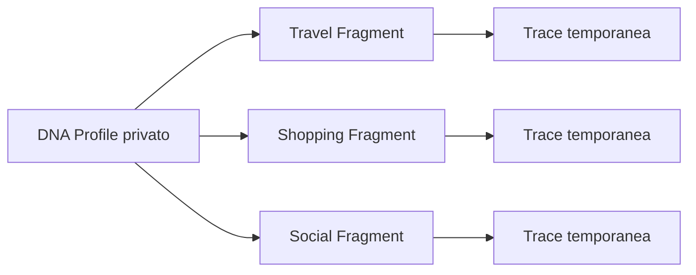
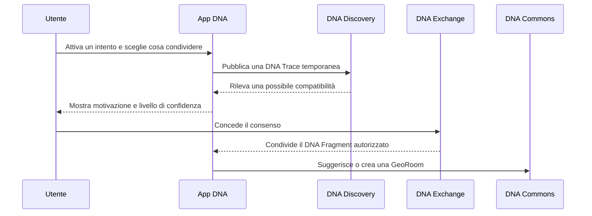

# Visione e principi

## 1. Visione

DNA è una piattaforma per rappresentare e mettere in relazione **persone, luoghi, intenzioni, disponibilità e servizi** senza trasformare ogni dominio in un'applicazione isolata.

Travel è il primo verticale, non il confine della piattaforma. La stessa grammatica deve poter descrivere:

- un viaggiatore che cerca un trasferimento condiviso;
- una famiglia che vuole acquistare un prodotto al prezzo migliore;
- più utenti interessati a un acquisto di gruppo;
- un rider disponibile per una missione;
- persone presenti nella stessa zona con interessi compatibili;
- una conversazione collegata a un luogo, un perimetro o una tratta;
- un commerciante che risponde a domanda aggregata locale.

La piattaforma non deve limitarsi a suggerire una corrispondenza. Deve accompagnare il passaggio:

```text
scoperta → compatibilità → consenso → conversazione → accordo → azione
```

## 2. Perché il nome DNA

Il DNA non è un profilo pubblico monolitico. È un insieme di caratteristiche e intenzioni dal quale vengono generati frammenti diversi in base al contesto.



Il profilo completo resta privato. I servizi vedono solo quanto necessario allo scopo dichiarato.

## 3. Principi di prodotto

### 3.1 Utile anche con pochi utenti

Ogni verticale deve offrire valore prima di raggiungere effetti di rete importanti. Shopping DNA, per esempio, deve essere utile come comparatore del paniere e storico prezzi anche prima di avere gruppi d'acquisto o rider.

### 3.2 Automazione senza eliminare il coordinamento umano

Il sistema può calcolare compatibilità, percorsi, prezzi e proposte. Gli utenti devono però poter parlare, chiarire vincoli e organizzarsi direttamente tramite GeoChat e stanze temporanee.

### 3.3 Mappa come interfaccia comune

La mappa non mostra solo destinazioni. Mostra anche:

- luoghi e aree;
- chat e topic;
- intenzioni aggregate;
- gruppi e campagne;
- offerte e segnalazioni;
- eventi temporanei;
- opportunità di viaggio, acquisto o consegna.

### 3.4 Trasporti di comunicazione intercambiabili

LoRa, BLE, NFC, Wi-Fi, Wi-Fi Direct/Aware, rete mobile e Internet sono strumenti con capacità diverse. Nessuno di essi deve diventare una dipendenza del dominio.

### 3.5 Privacy by design

Una trace deve essere:

- minimale;
- pseudonima;
- temporanea;
- revocabile;
- limitata allo scopo;
- non direttamente riconducibile al profilo completo.

### 3.6 Compatibilità spiegabile

Il sistema deve poter dire perché propone un incontro o un gruppo:

> Stessa tratta, fascia oraria sovrapposta e disponibilità alla condivisione.

oppure:

> Stesso prodotto, stessa zona, soglia di prezzo compatibile e termine comune.

### 3.7 Nessun punteggio reputazionale universale

La fiducia è contestuale. Un utente può essere affidabile nella verifica dei prezzi ma non avere alcuna reputazione come rider o organizzatore di viaggi.

### 3.8 Lavoro equo nei servizi operativi

Quando la piattaforma coinvolge rider, shopper o contributor, il compenso e le regole di assegnazione devono essere trasparenti. Il rifiuto di una missione non deve produrre penalizzazioni nascoste.

## 4. Confini iniziali

La prima versione non deve tentare di costruire contemporaneamente un social network, un marketplace, un navigatore, un protocollo radio e una banca dati universale.

La baseline deve validare questo flusso:



## 5. Verticali iniziali

### TDNA / Travel DNA

- pianificazione e navigazione;
- compatibilità tra viaggiatori;
- tratte e transfer condivisi;
- chat associate a luoghi e percorsi;
- discovery locale opzionale.

### Shopping DNA

- osservazioni di prezzo e storico;
- ottimizzazione del paniere;
- sostituzioni economiche e qualitative;
- acquisti di gruppo;
- commercio locale e consegne eque;
- chat di negozio e di zona.

### Social DNA

Non è il primo verticale da implementare, ma è un caso utile per verificare la generalità del modello:

- interessi condivisibili;
- musica ed eventi;
- comunità territoriali;
- discovery di prossimità;
- consenso prima dello scambio dei dettagli.

## 6. Criterio guida

Una funzionalità entra nel core solo quando è usata da almeno due verticali o quando rappresenta una responsabilità chiaramente trasversale, come identità, consenso, GeoAnchor o transport adapter.