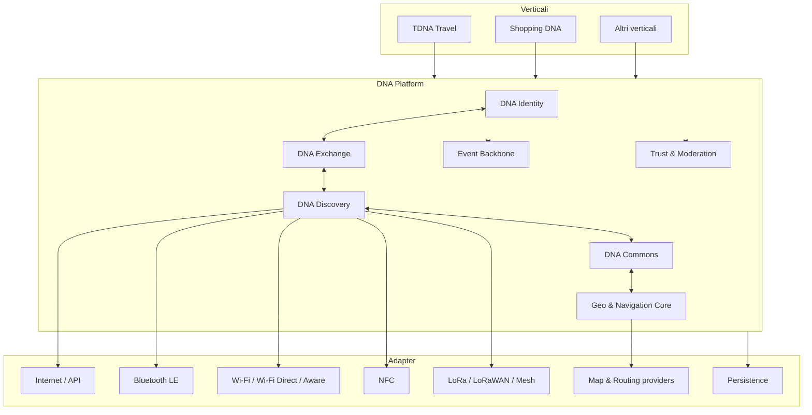
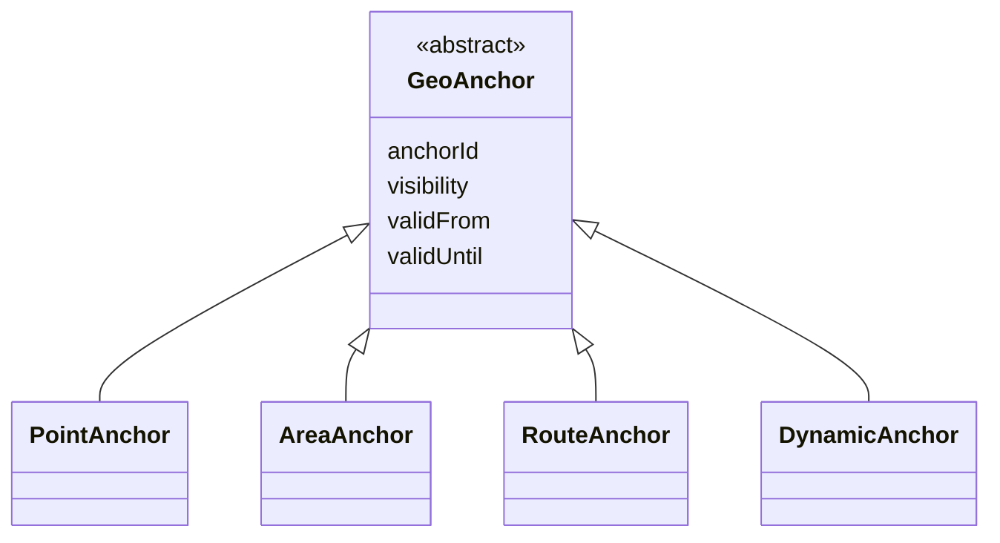
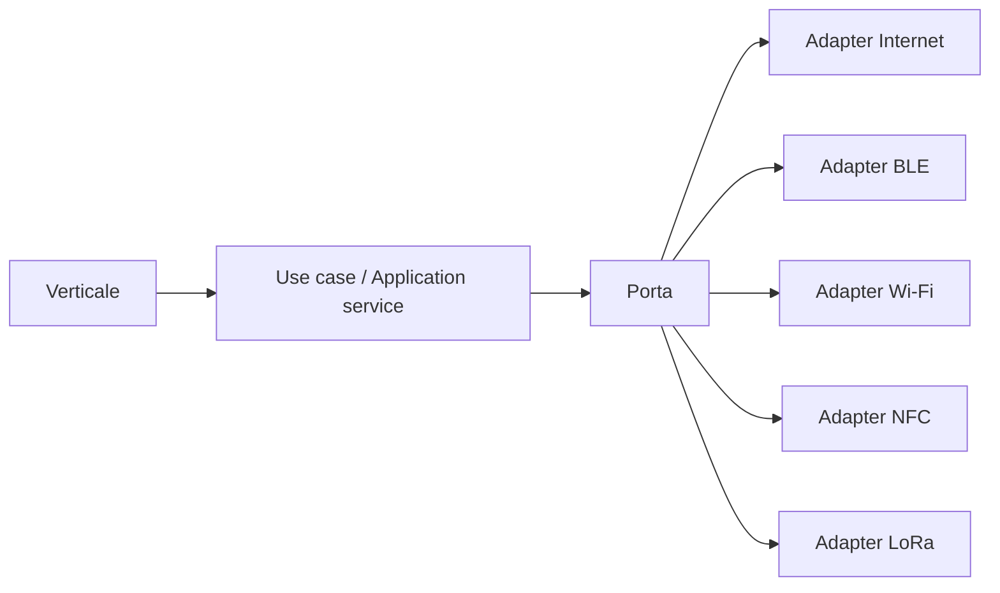

# Architettura della piattaforma

## 1. Obiettivo

L'architettura deve consentire a TDNA, Shopping DNA e ai futuri verticali di condividere capacità comuni senza diventare un monolite e senza accoppiarsi a tecnologie specifiche di rete, mappe o persistenza.

Il modello proposto combina:

- architettura esagonale;
- eventi di dominio;
- bounded context separati;
- adapter sostituibili;
- contratti versionati;
- privacy e consenso come responsabilità esplicite.

## 2. Vista generale



## 3. Bounded context

### 3.1 DNA Identity

Responsabilità:

- identità dell'account;
- identità dei dispositivi;
- pseudonimi e identificatori rotanti;
- chiavi e credenziali;
- associazione e revoca dei dispositivi;
- autenticazione e recupero dell'account.

Identity non decide quali dati condividere. Questa responsabilità appartiene a DNA Exchange.

### 3.2 DNA Exchange

Responsabilità:

- `DNAProfile`;
- `DNAFragment`;
- policy di visibilità;
- consenso;
- durata e scadenza;
- revoca;
- matching autorizzato;
- audit delle condivisioni.

Contratto concettuale:

```text
share(fragment, purpose, recipients, expiresAt) -> ConsentGrant
revoke(grantId)
evaluateCompatibility(subjectA, subjectB, context) -> Compatibility
```

### 3.3 DNA Discovery

Responsabilità:

- generare e rilevare `DNATrace`;
- scegliere uno o più transport adapter;
- effettuare pre-matching locale o remoto;
- gestire beacon, deduplicazione, TTL e budget radio;
- stabilire il rendezvous per il canale successivo.

Discovery non trasporta necessariamente i contenuti reali. Il suo compito principale è rilevare una possibilità e trovare il modo sicuro di proseguire.

### 3.4 DNA Commons

Responsabilità:

- GeoRoom;
- topic;
- thread e messaggi;
- gruppi e membership;
- sottoscrizioni;
- stanze temporanee legate a intenti o transazioni;
- moderazione;
- trasformazione di conversazioni in oggetti strutturati.

### 3.5 Geo & Navigation Core

Responsabilità:

- punti, luoghi, aree e tratte;
- `GeoAnchor`;
- geocodifica;
- percorsi e alternative;
- ottimizzazione multi-stop;
- finestre temporali;
- costo generalizzato del percorso;
- clustering degli elementi sulla mappa.

Il core non deve conoscere il significato di “viaggio turistico” o “spesa”. Riceve vincoli e restituisce soluzioni geografiche.

### 3.6 Trust & Moderation

Responsabilità:

- attestazioni di presenza;
- affidabilità delle osservazioni;
- reputazione per ruolo e dominio;
- segnalazioni;
- contestazioni;
- moderazione delle GeoRoom;
- rilevamento spam e abuso;
- provenance delle informazioni.

## 4. Entità comuni

```text
DNAProfile
DNAFragment
DNATrace
DNAIntent
ConsentGrant
Compatibility
Rendezvous
DeviceIdentity
GeoAnchor
Place
Zone
RouteAnchor
GeoRoom
Topic
Subscription
TrustAssertion
```

### 4.1 DNAProfile

Persistente, privato, modificabile dal soggetto. Può contenere preferenze, vincoli, disponibilità e relazioni, ma non deve essere direttamente interrogabile dai verticali.

### 4.2 DNAFragment

Vista limitata e versionata del profilo.

Campi minimi:

```text
fragmentId
subjectId
schema
purpose
claims
visibility
allowedRecipients
validFrom
expiresAt
revocable
provenance
```

### 4.3 DNATrace

Segnale minimo per discovery. Non è una copia compressa del profilo.

```text
traceVersion
ephemeralId
domainMask
capabilityMask
coarseContext
interestOrIntentHints
rendezvousHint
issuedAt
expiresAt
antiReplayData
signatureOrAuthenticator
```

### 4.4 DNAIntent

Rappresenta uno stato attivo orientato a un risultato:

```text
intentType
constraints
geoScope
timeWindow
participationPolicy
matchingPolicy
status
expiresAt
```

Esempi: trasferimento condiviso, acquisto di gruppo, richiesta di consegna, interesse per un evento.

### 4.5 GeoAnchor



## 5. Eventi comuni

Gli eventi devono descrivere fatti già avvenuti e non chiamate imperative.

```text
DNAFragmentCreated
ConsentGranted
ConsentRevoked
DNATraceCreated
DNATracePublished
DNATraceDetected
CompatibilityDetected
RendezvousRequested
RendezvousAccepted
GeoRoomSuggested
GeoRoomCreated
SubscriptionMatched
TrustAssertionAdded
IntentCreated
IntentExpired
```

Ogni evento deve includere:

```text
eventId
eventType
schemaVersion
occurredAt
producer
correlationId
causationId
subjectRef
privacyClassification
payload
```

## 6. Porte e adapter

I bounded context espongono porte; le tecnologie concrete sono adapter.

```text
DiscoveryPort
CommunicationTransportPort
GeoProviderPort
RoutingProviderPort
MessageRepositoryPort
EventPublisherPort
IdentityCredentialPort
ModerationPort
```

I verticali dipendono dai contratti applicativi, non dagli adapter concreti.



## 7. Persistenza e proiezioni

Non è necessario adottare event sourcing completo nella prima fase. È sufficiente:

- database transazionale per stato corrente;
- outbox per pubblicazione affidabile degli eventi;
- log di audit per consenso e condivisioni;
- proiezioni dedicate per mappa, sottoscrizioni e matching;
- time-series o storage specializzato solo dove giustificato, ad esempio storico prezzi.

## 8. Regola di estrazione dal verticale

Una capacità nasce nel verticale che la rende necessaria. Viene estratta nel core quando:

1. almeno due verticali la usano realmente; oppure
2. appartiene chiaramente a identità, consenso, geografia, discovery o comunicazione; oppure
3. duplicarla produrrebbe rischi di privacy o incoerenza.

Questo evita sia il monolite sia la generalizzazione prematura.

## 9. Deployment iniziale

Per il pilot è preferibile un **modular monolith** con confini netti, eventi interni e moduli separati, invece di microservizi prematuri.

```text
app-backend/
  identity/
  exchange/
  discovery/
  commons/
  geo/
  trust/
  verticals/
    travel/
    shopping/
```

I moduli potranno essere separati in servizi solo in presenza di esigenze misurate di scalabilità, isolamento o autonomia organizzativa.