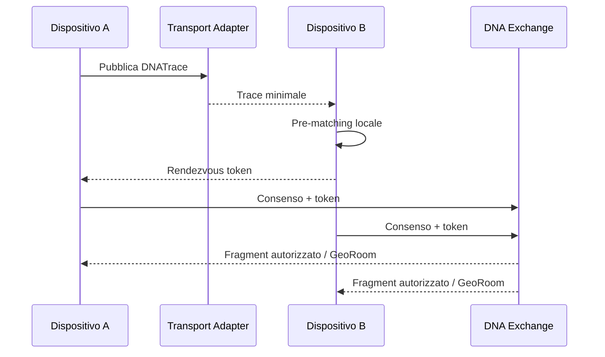
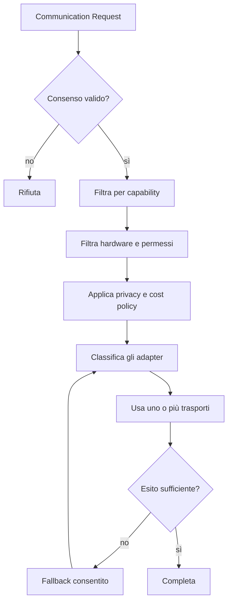

# DNA Discovery e adapter di comunicazione

## 1. Decisione fondamentale

DNA non deve “usare LoRa”, “usare BLE” o “usare Wi-Fi” come scelta globale. Deve possedere un livello di discovery e comunicazione che seleziona dinamicamente i mezzi disponibili in base a capacità, contesto, consenso e costo.

```text
Il dominio esprime un'intenzione di comunicazione.
Il livello di trasporto decide come realizzarla.
```

LoRa è una possibilità utile, soprattutto per discovery a lungo raggio e messaggi minimali. Non è la base obbligatoria della piattaforma.

## 2. Separare discovery, rendezvous e trasferimento

Questi tre passaggi non devono essere confusi.

### Discovery

Rileva che esiste un soggetto, luogo, gruppo o intento potenzialmente interessante.

### Rendezvous

Scambia le informazioni minime necessarie per concordare dove proseguire: endpoint, token monouso, identificatore di GeoRoom, QR, handover Wi-Fi o servizio Internet.

### Data exchange

Trasferisce i contenuti reali autorizzati: dettagli del DNA Fragment, messaggi, foto, mappe, cataloghi o ricevute.



Discovery e data exchange possono utilizzare trasporti diversi.

## 3. Adapter iniziali

### 3.1 Internet / rete mobile

Uso ideale:

- discovery remota per zona;
- matching globale;
- sincronizzazione completa;
- chat, immagini e mappe;
- pagamenti e transazioni;
- affidabilità e audit.

Limiti:

- dipendenza dalla connettività;
- maggiore esposizione dei metadati al backend;
- consumo e costi variabili.

### 3.2 Bluetooth Low Energy

Uso ideale:

- prossimità personale;
- beacon temporanei;
- eventi e luoghi affollati;
- discovery a basso consumo;
- collegamento smartphone-dispositivo LoRa.

Limiti:

- portata inferiore a LoRa;
- comportamento in background vincolato dai sistemi operativi;
- densità elevata e interferenze;
- necessità di identificatori rotanti.

### 3.3 Wi-Fi Aware / Wi-Fi Direct / rete locale

Uso ideale:

- discovery e collegamento diretto;
- trasferimento più ricco senza Internet;
- handover dopo BLE, NFC o LoRa;
- sincronizzazione locale di messaggi e mappe;
- gruppi temporanei.

Limiti:

- supporto non uniforme tra dispositivi;
- maggiore consumo;
- complessità nella gestione di ruoli, permessi e riconnessioni.

### 3.4 NFC

Uso ideale:

- consenso intenzionale e ravvicinato;
- scambio di un rendezvous token;
- ingresso in una GeoRoom;
- associazione di un dispositivo;
- check-in o conferma di ritiro;
- lettura di tag in luoghi e negozi.

Limiti:

- distanza minima;
- non adatto alla scoperta passiva di area;
- interazione generalmente esplicita.

NFC non compete con BLE o LoRa: è particolarmente utile quando si vuole dimostrare un gesto volontario.

### 3.5 LoRa, LoRaWAN e mesh LoRa

Uso ideale:

- discovery a lungo raggio;
- aree con rete assente o congestionata;
- trace e intenti molto compatti;
- gruppi in viaggio o attività outdoor;
- sensori e gateway territoriali;
- rete comunitaria resiliente.

Limiti:

- smartphone generalmente privi di radio LoRa;
- banda molto ridotta;
- vincoli normativi e di duty cycle;
- hardware aggiuntivo;
- rischio di collegabilità e tracciamento radio;
- topologie diverse tra LoRaWAN e mesh.

Uso raccomandato in DNA:

```text
LoRa trasporta la traccia o il rendezvous.
Wi-Fi, 5G o Internet trasportano i contenuti reali.
```

## 4. Contratto dell'adapter

L'interfaccia non deve fingere che tutti i trasporti abbiano le stesse caratteristiche.

```text
CommunicationTransport
  id(): TransportId
  capabilities(): TransportCapabilities
  observeState(): ConnectivityState
  advertise(envelope, policy): PublicationHandle
  scan(filter, policy): Stream<ReceivedEnvelope>
  send(peerOrEndpoint, envelope, policy): DeliveryResult
  stop(handle)
```

### 4.1 Capability dichiarate

```text
TransportCapabilities
- supportsBroadcast
- supportsPeerToPeer
- supportsInfrastructure
- supportsBackgroundDiscovery
- supportsAcknowledgement
- supportsMulticast
- supportsHighBandwidth
- supportsOfflineOperation
- supportsRangeEstimate
- supportsProximityProof
- supportsMutualAuthentication
- maxPayloadBytes
- expectedRangeClass
- latencyClass
- energyCostClass
- monetaryCostClass
- privacyExposureClass
- regulatoryConstraints
```

La logica applicativa può quindi chiedere una capacità invece di scegliere una tecnologia:

```text
Richiesta:
- broadcast locale
- payload <= 64 byte
- basso consumo
- nessuna infrastruttura obbligatoria

Possibili adapter:
- BLE advertising
- LoRa mesh
```

## 5. Transport policy

Ogni pubblicazione deve essere accompagnata da una policy.

```text
TransportPolicy
- purpose
- requiredCapabilities
- preferredTransports
- forbiddenTransports
- maximumPayload
- maximumEnergyCost
- maximumMonetaryCost
- maximumPrivacyExposure
- deliveryUrgency
- retryPolicy
- expiry
- fallbackAllowed
- userConsentRef
```

Esempio Travel:

```text
purpose: discover-shared-transfer
required: broadcast, background-discovery
maxPayload: 80 bytes
expiry: 15 minutes
preferred: BLE, LoRa
fallback: Internet proximity
```

Esempio NFC:

```text
purpose: confirm-group-pickup
required: proximity-proof, explicit-gesture
preferred: NFC
fallback: QR code
```

## 6. Selezione dinamica del trasporto

Il `TransportOrchestrator` valuta:

1. consenso dell'utente;
2. disponibilità hardware;
3. permessi del sistema operativo;
4. capacità richieste;
5. dimensione del payload;
6. stato della rete;
7. costo energetico e monetario;
8. privacy;
9. affidabilità attesa;
10. policy del verticale.



Non è sempre necessario selezionare un solo adapter. Una trace potrebbe essere pubblicata su BLE e Internet, con deduplicazione tramite `traceId`.

## 7. Envelope indipendente dal trasporto

```text
TransportEnvelope
- envelopeVersion
- messageType
- messageId
- ephemeralSenderId
- correlationId
- issuedAt
- expiresAt
- priority
- hopLimit
- contentEncoding
- payload
- authenticationData
```

Il payload della `DNATrace` deve restare separato dall'envelope. In questo modo lo stesso contenuto può essere inviato via BLE, LoRa, NFC o Internet senza inserire dettagli della tecnologia nel dominio.

## 8. DNA Trace v0.1

Obiettivo iniziale: trace tra 32 e 96 byte nei profili compatti, senza rendere questo limite una costante universale.

Informazioni ammesse:

- versione;
- ID effimero;
- domini e intenti espressi come codici;
- contesto geografico grossolano opzionale;
- capability di rendezvous;
- validità;
- nonce o contatore anti-replay;
- autenticatore compatto.

Informazioni da non trasmettere in chiaro:

- nome e account;
- contatti;
- posizione precisa;
- playlist o preferenze complete;
- lista acquisti;
- destinazione precisa quando sensibile;
- identificatore persistente del dispositivo.

## 9. Handover

Il rendezvous può proporre uno o più canali:

```text
RendezvousDescriptor
- rendezvousId
- oneTimeToken
- supportedChannels
- preferredChannel
- endpointHints
- expiresAt
- requiredConsent
- keyAgreementData
```

Esempi:

- BLE rileva la trace, Internet completa il matching;
- LoRa rileva una compatibilità, il telefono usa 5G per entrare nella GeoRoom;
- NFC scambia un token e Wi-Fi Direct trasferisce dati offline;
- Internet segnala una comunità locale, BLE verifica la prossimità.

## 10. Simulatore prima dell'hardware

Il primo adapter deve essere `MockTransportAdapter`, configurabile con:

- banda e payload massimi;
- latenza;
- perdita;
- duplicazione;
- riordinamento;
- partizionamento di rete;
- gateway intermittente;
- consumo stimato;
- numero massimo di messaggi;
- raggio simulato.

Questo permette di testare il protocollo prima di acquistare hardware o dipendere da un singolo SDK.

## 11. Strategia di implementazione

Ordine raccomandato:

1. `InternetTransportAdapter` per il flusso end-to-end;
2. `MockTransportAdapter` per test di resilienza;
3. `BleDiscoveryAdapter` per smartphone Android;
4. `NfcRendezvousAdapter` per consenso e check-in;
5. `WifiPeerTransferAdapter` per scambio locale più ricco;
6. `LoRaDiscoveryAdapter` sperimentale tramite dispositivo companion;
7. `LoRaWanInfrastructureAdapter` solo per casi con gateway e sensori.

## 12. Regola architetturale

Nessuna entità del dominio può contenere campi come:

```text
loraChannel
bleServiceUuid
wifiSsid
nfcTagId
```

Questi dettagli appartengono agli adapter e ai descriptor di rendezvous, non a `DNAIntent`, `GeoRoom` o `DNAFragment`.