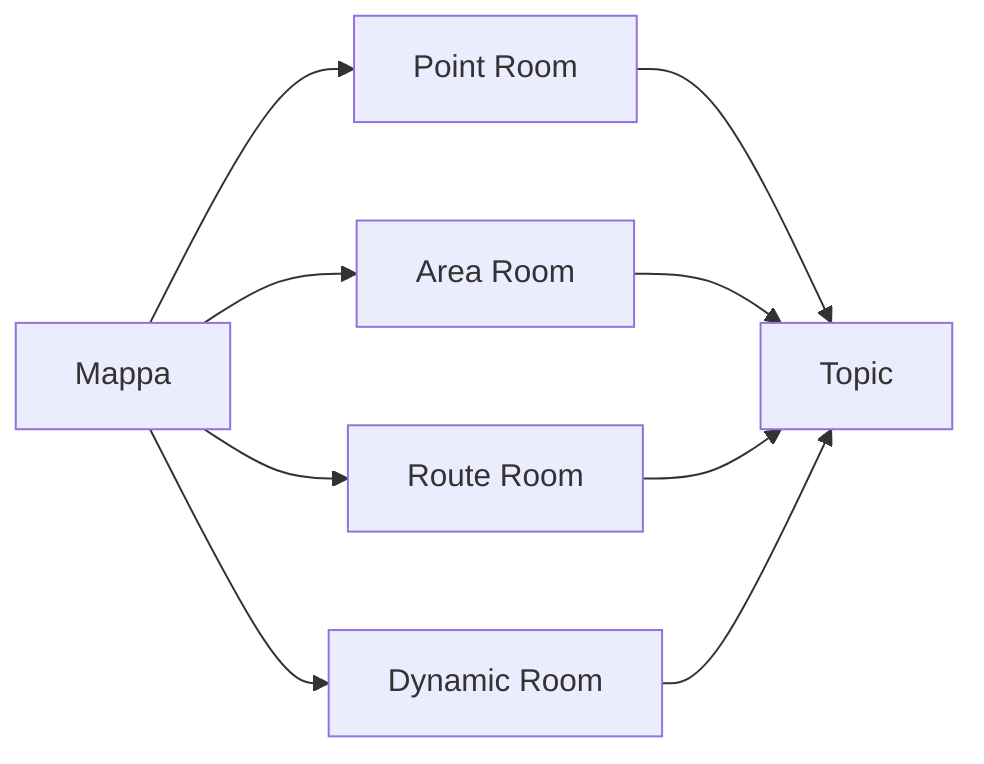
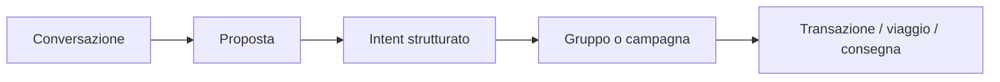

# DNA Commons, GeoChat e mappa

## 1. Ruolo di DNA Commons

DNA Commons è il livello sociale e collaborativo condiviso da tutti i verticali. Non è un social network generalista: ogni conversazione deve essere collegata a un luogo, una zona, una tratta, un intento, un gruppo o una transazione reale.

Responsabilità principali:

- conversazioni geografiche;
- topic;
- gruppi;
- sottoscrizioni;
- stanze temporanee;
- moderazione;
- trasformazione della conversazione in oggetti strutturati.

## 2. La mappa come superficie primaria

Le GeoRoom associate a luoghi, aree e percorsi devono essere visibili direttamente nel navigatore.



### 2.1 Tipi di GeoAnchor

#### PointAnchor

Per un punto specifico:

- negozio;
- stazione;
- fermata;
- ristorante;
- parcheggio;
- attrazione;
- punto di ritiro.

#### AreaAnchor

Per un perimetro:

- quartiere;
- comune;
- centro commerciale;
- aeroporto;
- spiaggia;
- mercato;
- area di evento.

#### RouteAnchor

Per una tratta o un corridoio:

- Messina → aeroporto di Catania;
- linea ferroviaria;
- itinerario turistico;
- percorso di consegna;
- autostrada o segmento stradale.

#### DynamicAnchor

Per una zona temporanea o mobile:

- gruppo in escursione;
- area interessata da un problema;
- punto di ritrovo che cambia;
- evento itinerante;
- cluster di consegne.

## 3. Tipi di stanza

### Place Room

Permanente e pubblica o semi-pubblica. Raccoglie conversazioni generali su un luogo.

### Topic Room

Permanente ma focalizzata:

```text
#offerte
#disponibilità
#accessibilità
#trasporti
#code
#eventi
#acquisti-di-gruppo
#segnalazioni
```

### Intent Room

Temporanea e creata quando più intenti sono compatibili. Esempi:

- persone interessate allo stesso transfer;
- acquisto collettivo di un prodotto;
- gruppo per un evento;
- utenti che cercano una consegna nella stessa zona.

### Transaction Room

Privata e collegata a un impegno concreto:

- ordine collettivo;
- consegna;
- viaggio condiviso;
- prenotazione;
- pagamento o rimborso.

## 4. Modello minimo

```text
GeoRoom
- roomId
- roomType
- geoAnchorId
- title
- verticalTags
- topicIds
- visibility
- participationPolicy
- moderationPolicy
- createdAt
- validUntil
- status
```

```text
Message
- messageId
- roomId
- authorPseudonym
- messageType
- bodyOrReference
- createdAt
- expiresAt
- provenance
- verificationState
- moderationState
```

```text
Subscription
- subscriptionId
- subjectId
- geoScope
- verticalFilter
- topicFilter
- condition
- deliveryPolicy
- quietHours
- expiresAt
```

## 5. Topic controllati e topic emergenti

Una tassonomia base evita frammentazione e duplicati. Gli utenti possono proporre topic aggiuntivi, ma sinonimi e varianti devono essere ricondotti a concetti comuni.

Esempio:

```text
#offerta
#offerte
#sconto
#promozione
```

possono essere normalizzati nel topic canonico `offers`, mantenendo le etichette localizzate nell'interfaccia.

## 6. Visualizzazione sulla mappa

### 6.1 Livelli di zoom

A zoom basso:

- cluster per area;
- conteggio delle attività;
- indicatori di importanza;
- nessuna identità individuale.

A zoom medio:

- stanze per luogo o zona;
- topic principali;
- gruppi e campagne attive.

A zoom alto:

- singole GeoRoom;
- stato di attività;
- ultimo aggiornamento verificato;
- azioni disponibili.

### 6.2 Filtri

```text
Verticale:
[x] Travel
[x] Shopping
[ ] Social

Contenuto:
[x] domande
[x] gruppi
[x] offerte
[ ] conversazioni generali
[x] segnalazioni verificate
```

### 6.3 Privacy cartografica

La mappa non deve mostrare automaticamente persone o dispositivi. Deve mostrare:

- stanze;
- conteggi aggregati;
- opportunità;
- eventi;
- attività per zona.

Esempio corretto:

> 7 DNA interessati alla musica dal vivo in questa area.

Esempio da evitare:

> Antonio è qui e ascolta Queen.

## 7. Presenza e partecipazione

Una stanza può distinguere:

- lettura remota;
- partecipazione remota;
- presenza locale dichiarata;
- presenza locale verificata;
- ruolo ufficiale del luogo o del commerciante.

La verifica di presenza può derivare da:

- geofencing con precisione ridotta;
- BLE beacon;
- NFC o QR nel luogo;
- rete Wi-Fi del luogo;
- attestazione firmata da un dispositivo;
- più conferme indipendenti.

Nessuna prova deve diventare automaticamente una posizione pubblica.

## 8. Dalla conversazione all'azione

La chat è utile per negoziare, ma gli accordi devono diventare oggetti strutturati.



Esempi:

- “Compriamo l'olio se scende sotto 6 euro” → `GroupPurchaseIntent`;
- “Condividiamo il transfer” → `SharedTransferProposal`;
- “Qualcuno può ritirare questo ordine?” → `DeliveryRequest`;
- “L'offerta è terminata” → `ProductAvailabilityObservation`.

## 9. Sottoscrizioni

Le sottoscrizioni sono query persistenti, non semplici notifiche di chat.

Possibili target:

- luogo;
- zona;
- tratta;
- topic;
- prodotto;
- intento compatibile;
- soglia di gruppo;
- condizione su prezzo, tempo o distanza.

Esempio:

```text
productCategory = diapers
AND size = 5
AND distance <= 15 km
AND groupPrice <= 9 EUR
AND groupQuantity >= 10
```

### Politiche di consegna

- immediata;
- riepilogo periodico;
- solo eventi verificati;
- solo cambiamenti rilevanti;
- silenzio in determinate fasce orarie.

## 10. Moderazione e qualità

Ogni contenuto deve distinguere tra:

- opinione;
- domanda;
- osservazione;
- offerta commerciale;
- informazione ufficiale;
- emergenza;
- dato verificato.

Stati possibili:

```text
UNVERIFIED
PRESENCE_VERIFIED
COMMUNITY_CONFIRMED
MERCHANT_CONFIRMED
OFFICIAL_SOURCE
DISPUTED
EXPIRED
```

La reputazione è separata per ruolo:

- contributor prezzi;
- rider;
- viaggiatore;
- commerciante;
- moderatore;
- organizzatore.

## 11. Eventi di DNA Commons

```text
GeoRoomCreated
GeoRoomExpired
UserJoinedGeoRoom
MessagePublished
TopicFollowed
PlaceFollowed
SubscriptionMatched
ConversationConvertedToIntent
GroupThresholdReached
InformationVerified
ModerationCaseOpened
ModerationCaseResolved
```

## 12. Primo pilot

Il primo pilot deve includere:

1. chat di un punto;
2. chat di un'area;
3. chat di una tratta;
4. topic predefiniti;
5. cluster sulla mappa;
6. sottoscrizione a luogo e topic;
7. Intent Room temporanea;
8. conversione di una conversazione in un oggetto strutturato;
9. presenza locale simulata;
10. moderazione minima e scadenza dei messaggi temporanei.