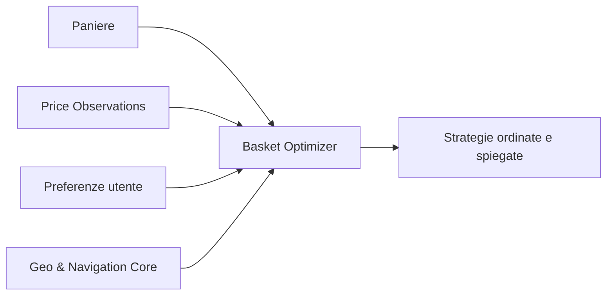

# Shopping DNA

## 1. Obiettivo

Shopping DNA è il verticale dedicato alla spesa, agli acquisti locali, ai prezzi, alla domanda aggregata e alla logistica equa. Non deve ridursi a un comparatore o a una piattaforma di delivery.

La proposta di valore è collegare:

- prodotti;
- prezzi nel tempo;
- negozi e luoghi;
- intenzioni di acquisto;
- alternative economiche e qualitative;
- gruppi d'acquisto;
- commercianti;
- contributor, shopper e rider;
- navigazione e ottimizzazione dei percorsi.

## 2. Principio di partenza

Il primo prodotto deve essere utile anche senza commercianti integrati e senza rider:

> L'utente crea un paniere e il sistema calcola la strategia di acquisto realmente più conveniente, considerando prezzi, distanza, tempo, offerte e preferenze.

```text
costo reale =
  costo prodotti
  + costo viaggio o consegna
  + valore del tempo
  - sconti
  - risparmio di gruppo
  - vantaggi fedeltà applicabili
```

## 3. Modello del prezzo

Il prezzo non è un attributo stabile del prodotto. È un'osservazione contestuale e temporale.

```text
PriceObservation
- observationId
- productIdentity
- variant
- quantity
- unit
- storeId
- geoAnchorId
- regularPrice
- promotionalPrice
- unitPrice
- promotionConditions
- loyaltyRequirement
- observedAt
- validUntil
- sourceType
- evidenceRef
- confidence
- verificationState
```

Fonti possibili:

- scontrino;
- scansione di prodotto ed etichetta;
- volantino;
- catalogo online;
- API o gestionale del commerciante;
- contributor;
- osservazione ufficiale del negozio.

## 4. Identità del prodotto

La normalizzazione deve distinguere:

- EAN/GTIN;
- marca;
- variante;
- formato;
- quantità;
- unità;
- confezione multipla;
- prodotto sfuso;
- equivalenze e sostituzioni.

```text
ProductIdentity
- canonicalProductId
- gtinSet
- brand
- name
- variant
- packageQuantity
- packageUnit
- category
- attributes
- provenance
```

## 5. Funzioni progressive

### Price Radar

- ricerca prodotto;
- prezzo per unità;
- storico locale;
- minimo e massimo osservati;
- alert di ribasso;
- freschezza e affidabilità del dato;
- segnalazioni della comunità.

L'indicazione “minimo storico” deve specificare l'intervallo e l'area:

> Vicino al minimo osservato negli ultimi 180 giorni entro 15 km.

### Basket Optimizer

- lista della spesa;
- confronto dell'intero paniere;
- uno o più negozi;
- costi di spostamento;
- tempo stimato;
- finestre di apertura;
- disponibilità e rischio di dato scaduto;
- sostituzioni.

Il risultato non deve proporre automaticamente molti negozi per piccoli risparmi.

### Alternative

Le alternative devono essere spiegabili e suddivise:

- più economica;
- migliore prezzo per unità;
- qualità superiore;
- profilo nutrizionale preferibile;
- locale;
- sostenibile;
- compatibile con preferenze o allergeni dichiarati.

Non deve esistere un unico punteggio opaco “salutare”.

### Acquisti di gruppo

Gli utenti pubblicano intenti anonimi o pseudonimi per area e periodo.

```text
GroupPurchaseIntent
- productOrCategory
- acceptableVariants
- individualQuantity
- targetUnitPrice
- geoScope
- joinDeadline
- fulfillmentWindow
- pickupOrDeliveryPreference
- commitmentPolicy
```

Il sistema aggrega la domanda e permette a commercianti o fornitori di proporre offerte.

### Campagne dei commercianti

Un commerciante può:

- pubblicare offerte;
- proporre una soglia quantità;
- rispondere a domanda aggregata;
- limitare l'offerta per zona o periodo;
- indicare disponibilità;
- definire ritiro o consegna.

Le offerte sponsorizzate devono essere chiaramente distinte dai risultati organici.

## 6. GeoChat per Shopping

Ogni negozio o area commerciale può avere:

```text
#offerte
#disponibilità-prodotti
#qualità
#code
#accessibilità
#acquisti-di-gruppo
#consegne
#assistenza
```

Le conversazioni possono produrre osservazioni strutturate:

```text
“L'olio è terminato alle 18:20”
    ↓
ProductAvailabilityObservation
```

Il dato conserva autore, presenza, prova, orario, TTL e livello di verifica.

## 7. Contributor, shopper e rider

I ruoli sono separati anche quando la stessa persona ne ricopre più di uno.

### Contributor

Raccoglie o verifica prezzi, disponibilità e condizioni delle offerte.

### Shopper

Effettua materialmente gli acquisti e gestisce sostituzioni autorizzate.

### Rider

Trasporta e consegna.

### Verifier

Controlla osservazioni contestate o ad alto impatto.

Ogni missione deve dichiarare:

- attività richiesta;
- compenso;
- distanza;
- peso;
- tempo stimato;
- attesa prevista;
- difficoltà;
- responsabilità;
- condizioni di annullamento.

## 8. Carta del lavoro equo

Principi iniziali:

- compenso completo prima dell'accettazione;
- nessuna penalizzazione nascosta per il rifiuto;
- pagamento dell'attesa prevista o documentata;
- maggiorazioni esplicite per peso, scale, maltempo e orari;
- compenso minimo per missione;
- mance integralmente al lavoratore;
- possibilità di contestazione;
- spiegazione delle assegnazioni;
- reputazione contestuale e non universale;
- partecipazione dei lavoratori alla definizione delle regole.

## 9. Integrazione con il navigatore

Shopping usa il Geo & Navigation Core per:

- trovare negozi;
- calcolare il costo generalizzato della spesa;
- ottimizzare più fermate;
- pianificare ritiri e consegne;
- aggregare ordini compatibili;
- rispettare finestre temporali;
- stimare peso e capacità;
- mostrare chat e gruppi sulla mappa.



## 10. Integrazione con la contabilità familiare

Shopping DNA non deve gestire conti correnti, entrate o patrimonio. Comunica con un servizio separato mediante eventi e contratti minimali.

Eventi in uscita:

```text
BasketPurchased
ReceiptImported
ProductPurchased
DiscountApplied
DeliveryPaid
GroupSavingGenerated
RefundReceived
```

Vincoli in ingresso:

```text
CategoryBudgetDefined
SpendingLimitChanged
SavingsGoalUpdated
```

Il servizio Shopping riceve soltanto i vincoli necessari, non l'intera situazione finanziaria.

## 11. Primo pilot locale

Area consigliata: una zona circoscritta della provincia di Messina.

Obiettivi:

- 3–5 supermercati;
- 300–1.000 prodotti frequenti;
- 20–50 famiglie;
- raccolta tramite scontrini e scansioni;
- storico prezzi;
- paniere intelligente;
- chat di negozio;
- una prima Intent Room per acquisto collettivo;
- nessuna consegna nel primo rilascio.

## 12. Metriche

- percentuale del paniere riconosciuta;
- freschezza media dei prezzi;
- errore tra prezzo previsto e reale;
- risparmio medio netto di tempo e viaggio;
- numero di osservazioni verificate;
- tasso di sostituzioni accettate;
- gruppi che raggiungono la soglia;
- compenso orario effettivo dei lavoratori;
- contestazioni e tempi di risoluzione;
- valore prodotto prima degli effetti di rete.