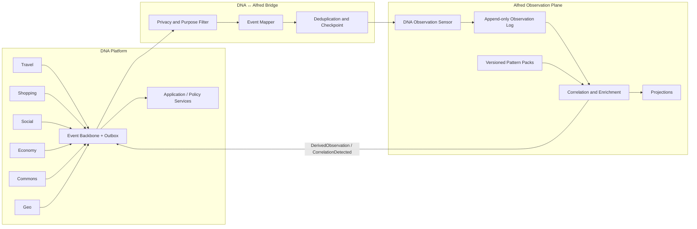

# Alfred come Observation e Correlation Runtime per DNA

## 1. Stato e obiettivo

- **Stato:** proposta architetturale v0.1
- **Ambito:** integrazione tra DNA e `kinderp/alfred`
- **Vincolo:** non modifica la milestone corrente di Alfred e non rende DNA dipendente dalla sua disponibilità

Questa proposta definisce come Alfred possa evolvere, nel tempo, da motore di correlazione filesystem/security a **piano di osservazione e correlazione trasversale** per gli eventi prodotti dai domini DNA: Travel, Shopping, Social, Economy, Commons, Geo e futuri verticali.

La decisione sintetica è:

```text
DNA possiede identità, consenso, stato di dominio e transazioni.
Alfred osserva eventi autorizzati, conserva provenance, correla segnali
eterogenei e produce inferenze spiegabili.
```

Alfred non diventa il database primario di DNA, l'event bus, il motore dei pagamenti o il luogo in cui vivono le regole di business dei verticali.

## 2. Perché Alfred è adatto

La documentazione di Alfred ha già fissato principi compatibili con DNA:

- un record comune separa fatto osservato, normalizzazione, semantica, diagnostica e decisione;
- i backend sono sensori con capability dichiarate;
- osservazioni e inferenze devono restare separate;
- il log append-only descrive cosa è successo, mentre le projection descrivono lo stato creduto corrente;
- un futuro correlation/enrichment engine collega record provenienti da fonti differenti;
- provenance, evidence, confidence e replay sono obiettivi espliciti;
- il percorso caldo deve restare corto e le elaborazioni pesanti devono vivere a valle della coda;
- le astrazioni devono essere introdotte solo quando pagano il proprio costo con casi d'uso e test reali.

Riferimenti Alfred:

- [`38-visione-observation-runtime.md`](https://github.com/kinderp/alfred/blob/main/docs/it/38-visione-observation-runtime.md)
- [`39-principi-architetturali-futuri.md`](https://github.com/kinderp/alfred/blob/main/docs/it/39-principi-architetturali-futuri.md)
- [`29-event-model-v0.md`](https://github.com/kinderp/alfred/blob/main/docs/it/29-event-model-v0.md)
- [`30-backend-api-v0.md`](https://github.com/kinderp/alfred/blob/main/docs/it/30-backend-api-v0.md)
- [`23-roadmap-plugin-backend.md`](https://github.com/kinderp/alfred/blob/main/docs/it/23-roadmap-plugin-backend.md)

## 3. Confine delle responsabilità

| Responsabilità | DNA | Alfred |
|---|---:|---:|
| Account, identità e dispositivi | sì | no |
| Profilo DNA privato | sì | no |
| Consenso e revoca | sì | osserva gli eventi autorizzati |
| Stato transazionale corrente | sì | può costruire projection analitiche |
| Eventi di dominio | produce e possiede | consuma copie minimizzate |
| Provenance e catena delle evidenze | produce metadati sorgente | conserva e arricchisce |
| Correlazione temporale e multi-dominio | può fare matching locale | sì, come funzione principale futura |
| Inferenze e pattern | usa i risultati | produce risultati spiegabili |
| Policy di business | sì | no |
| Enforcement di sicurezza runtime | no | possibile nel dominio security di Alfred |
| Azioni verso utenti e commercianti | sì | propone, non esegue direttamente |
| Pagamenti, ordini, prenotazioni | sì | solo eventi e audit autorizzati |

Regola:

```text
Alfred può suggerire che una situazione esiste.
Il bounded context DNA competente decide cosa farne.
```

## 4. Architettura proposta



L'integrazione è asincrona. Nessuna richiesta utente deve attendere Alfred nel percorso sincrono iniziale.

## 5. Flusso degli eventi

```text
1. Un bounded context DNA completa una transazione locale.
2. Scrive stato e outbox nello stesso confine transazionale.
3. L'Event Backbone pubblica l'evento di dominio.
4. Il DNA-Alfred Bridge applica consenso, minimizzazione e retention.
5. Il mapper preserva il significato originale dell'evento.
6. Alfred registra l'osservazione con provenance ed evidence reference.
7. Uno o più pattern correlano eventi nel tempo e tra domini.
8. Alfred emette una DerivedObservation o CorrelationDetected.
9. DNA valuta il risultato mediante il bounded context competente.
10. Eventuali azioni e outcome rientrano come nuovi eventi osservabili.
```

L'ultimo passaggio chiude il ciclo:

```text
observation -> correlation -> proposal -> decision -> action -> outcome -> feedback
```

## 6. Non degradare la semantica dell'evento sorgente

Un evento DNA come `IntentCreated` o `GeoRoomCreated` è già un evento semantico di applicazione. Il bridge non deve fingere che sia un segnale raw.

Mapping iniziale:

| Evento DNA | Livello Alfred concettuale | Nota |
|---|---|---|
| `DNATraceDetected` | observed / normalized observation | fatto di discovery con TTL |
| `IntentCreated` | semantic observation | stato dichiarato da un bounded context |
| `ConsentGranted` | semantic/audit observation | non contiene il fragment completo |
| `CompatibilityDetected` | inference observation | deve citare evidence e algoritmo |
| `GeoRoomCreated` | semantic observation | esistenza di uno spazio di coordinamento |
| `PriceObservationAdded` | measurement observation | valore, unità, luogo, tempo, fonte |
| `GroupThresholdReached` | derived semantic observation | deriva da più intenti e quantità |
| `RouteComputed` | plan observation | risultato di un planner geografico |
| `PurchaseCompleted` | outcome observation | evento transazionale minimizzato |
| `BudgetRiskDetected` | inference observation | prodotto dal dominio Economy o da Alfred |

Il modello Alfred corrente usa `layer + category + type`. Per DNA non bisogna aggiungere subito decine di enum al core C corrente. La prima integrazione usa un envelope esterno versionato e un adapter sperimentale. L'estensione dell'Event Model Alfred viene valutata solo dopo almeno due pattern reali e un replay funzionante.

## 7. DNA Observation Envelope v0

Il bridge deve ricevere eventi DNA attraverso un contratto minimo indipendente dal formato di trasporto.

```text
DNAObservationEnvelope
- schemaVersion
- eventId
- eventType
- sourceDomain
- sourceService
- sourceInstance
- occurredAt
- observedAt
- correlationId
- causationId
- subjectRefs[]
- objectRefs[]
- geoRef
- sessionRef
- consentRef
- purpose
- privacyClassification
- retentionClass
- evidenceRefs[]
- payloadSchema
- payload
```

Regole:

- `eventId` è stabile e permette deduplicazione;
- `occurredAt` indica quando il fatto è avvenuto;
- `observedAt` indica quando Alfred lo ha ricevuto;
- `subjectRefs` e `objectRefs` usano pseudonimi o riferimenti opachi;
- `consentRef` dimostra il fondamento dello scambio quando necessario;
- `evidenceRefs` puntano alle prove senza copiarle automaticamente;
- `payload` contiene solo i campi necessari al pattern autorizzato;
- il profilo DNA completo non entra mai nell'envelope;
- un evento revocato non viene cancellato retroattivamente dall'audit quando la legge o la sicurezza richiedono conservazione, ma i dati personali derivati devono essere rimossi o resi non collegabili secondo la policy applicabile.

## 8. Pattern pack caricabili

La generalizzazione più utile di Alfred per DNA non è un plugin radio o un nuovo backend OS. È un **pattern pack versionato** che descrive quali osservazioni correlare.

Contratto concettuale:

```text
CorrelationPattern
- patternId
- version
- status
- domains[]
- inputEventTypes[]
- requiredFields[]
- partitionKey
- temporalWindow
- spatialWindow
- predicates[]
- stateMachine
- evidencePolicy
- confidencePolicy
- outputObservationType
- privacyRequirements
- retentionPolicy
- testScenarios[]
```

Prima fase:

- pattern compilati o configurati staticamente;
- schema controllato;
- nessun codice arbitrario scaricato dalla rete;
- nessun plugin dinamico `.so`;
- golden test e replay obbligatori;
- output sempre distinto dagli input osservati.

Fase successiva, solo dopo stabilità:

- DSL dichiarativa limitata;
- registry di pattern firmati;
- sandbox per estensioni più complesse;
- versioning e migrazione dello stato delle correlazioni.

## 9. Pattern iniziali utili

### 9.1 Travel: trasferimento condiviso

Input:

```text
TravelIntentCreated
TravelIntentUpdated
RouteComputed
UserAvailabilityChanged
```

Correlazione:

- origine e destinazione compatibili;
- finestre temporali sovrapposte;
- capacità e bagagli compatibili;
- consenso alla condivisione;
- distanza dal punto di incontro entro soglia.

Output:

```text
SharedTransferOpportunityDetected
- evidenceRefs
- compatibilityScore
- explanation
- validUntil
```

DNA decide se proporre una Intent Room.

### 9.2 Shopping: acquisto di gruppo

Input:

```text
ShoppingIntentCreated
PriceObservationAdded
OfferPublished
GroupMemberJoined
```

Correlazione:

- stesso prodotto o sostituto ammesso;
- area compatibile;
- quantità aggregata sopra soglia;
- prezzo obiettivo raggiungibile;
- validità dell'offerta.

Output:

```text
GroupPurchaseOpportunityDetected
```

### 9.3 Travel + Shopping

Esempio:

```text
utente in viaggio verso una destinazione
+ lista acquisti attiva
+ negozio conveniente lungo il percorso
+ deviazione inferiore al limite scelto
= RouteShoppingOpportunityDetected
```

Il risultato non autorizza automaticamente acquisti o deviazioni. Produce una proposta spiegabile.

### 9.4 Shopping + Economy

```text
crescita del costo ricorrente di una categoria
+ budget mensile vicino alla soglia
+ alternativa equivalente disponibile
= BudgetAwareSubstitutionOpportunityDetected
```

Il servizio Economy resta proprietario del budget e decide quali dettagli rendere disponibili.

### 9.5 Social + Geo + Commons

```text
più tracce di interesse compatibili
+ stessa zona o evento
+ GeoRoom pubblica esistente
= LocalCommunityRoomSuggested
```

L'output deve essere aggregato e non rivelare chi si trova nella zona.

## 10. Projection utili

Alfred può costruire viste derivate senza diventare il database operativo di DNA:

- domanda aggregata per zona e categoria;
- stato di una correlazione temporanea;
- catena di evidence di una proposta;
- frequenza e affidabilità delle osservazioni di prezzo;
- andamento di un viaggio o ordine come episodio;
- risultati delle proposte: accettata, ignorata, completata, contestata;
- metriche sui falsi match e sulle spiegazioni comprese dagli utenti.

Le projection devono poter essere ricostruite mediante replay.

## 11. Privacy e sicurezza

### 11.1 Minimizzazione per pattern

Il bridge non pubblica un unico evento ricco verso Alfred. Ogni famiglia di pattern dichiara i campi minimi necessari.

Esempio:

```text
pattern: shared-transfer
necessita:
- area approssimata
- finestra temporale
- capacità richiesta
- bagaglio aggregato

non necessita:
- nome
- indirizzo di casa
- contatti
- cronologia completa dei viaggi
```

### 11.2 Pseudonimi separati

Gli identificatori usati nel piano di osservazione devono essere distinti dagli account ID operativi. La correlazione tra pseudonimo e identità resta nel bounded context Identity o in un servizio autorizzato.

### 11.3 Inferenze come affermazioni contestabili

Ogni inferenza contiene:

```text
source
patternId + version
evidenceRefs
confidence
explanation
validFrom / validUntil
privacyClassification
```

Non è una verità permanente sul soggetto.

### 11.4 Dati sensibili

Informazioni finanziarie, salute, minori, posizione precisa e contatti richiedono policy dedicate. Il default è non esportarle verso Alfred. Quando un pattern le richiede, si preferiscono:

- categorie;
- bucket;
- soglie booleane;
- computazione nel dominio sorgente;
- proof o claim derivati invece del dato originale.

## 12. Affidabilità e semantica di consegna

Per il primo bridge:

```text
DNA outbox -> at-least-once delivery -> Alfred deduplication
```

Non è richiesto exactly-once distribuito.

Servono:

- deduplicazione su `eventId`;
- checkpoint del consumer;
- dead-letter log;
- replay per intervallo o correlation ID;
- metriche di lag;
- backpressure;
- retention differenziata;
- quarantena degli eventi non validi;
- schema registry o almeno validazione versionata.

Se Alfred è indisponibile:

- DNA continua a eseguire i propri casi d'uso;
- l'outbox conserva gli eventi entro i limiti configurati;
- le inferenze possono arrivare in ritardo oppure scadere;
- una correlazione scaduta non deve essere proposta all'utente.

## 13. Deployment iniziale

Pilot consigliato:

```text
DNA modular monolith
  ├── database transazionale
  ├── outbox
  └── event publisher
          |
          v
DNA-Alfred Bridge sidecar/process
          |
          v
Alfred experimental observation consumer
  ├── append-only log
  ├── static pattern engine
  └── derived observation publisher
```

Nessun microservizio obbligatorio. Il bridge può iniziare come processo locale o tool di replay che legge JSONL prodotti dalla outbox di sviluppo.

## 14. Roadmap incrementale

### Fase A — Contratti e replay offline

- definire `DNAObservationEnvelope v0`;
- produrre fixture Travel e Shopping;
- mapper verso un record sperimentale Alfred;
- replay da JSONL;
- deduplicazione;
- golden test;
- nessuna modifica al runtime Alfred corrente.

### Fase B — Bridge asincrono

- leggere eventi da outbox o API locale;
- privacy filter;
- checkpoint;
- dead-letter;
- pubblicare derived observations verso DNA;
- osservabilità e metriche minime.

### Fase C — Due pattern reali

- `SharedTransferOpportunityDetected`;
- `GroupPurchaseOpportunityDetected`;
- spiegazione ed evidence;
- test di scadenza e consenso;
- replay deterministico.

### Fase D — Pattern cross-domain

- Travel + Shopping;
- Shopping + Economy;
- Social + Geo + Commons;
- projection aggregate;
- feedback sugli outcome.

### Fase E — Valutazione evoluzione Alfred

Solo dopo i pattern precedenti:

- estensione controllata dell'Event Model;
- categorie e observation kind non-filesystem;
- correlation engine generico;
- pattern pack versionati;
- eventuale API/plugin stabile;
- benchmark e profili separati dal security hot path.

## 15. Non obiettivi iniziali

- spostare il database DNA dentro Alfred;
- inviare `DNAProfile` completi;
- usare Alfred come broker generico;
- rendere sincrona la valutazione di ogni richiesta;
- creare subito una DSL Turing-complete;
- caricare codice di terzi non fidato;
- introdurre knowledge graph nel percorso caldo;
- unificare Alfred Security e DNA in un unico eseguibile;
- far decidere ad Alfred pagamenti, prenotazioni o consenso;
- modificare la roadmap corrente di Alfred prima di chiudere i contratti inotify/backend già pianificati.

## 16. Criteri di successo

La proposta è validata quando:

1. gli stessi eventi DNA possono essere riprodotti più volte con output deterministico;
2. Alfred produce una correlazione con evidence completa e senza leggere profili privati;
3. Travel e Shopping usano lo stesso envelope;
4. almeno un pattern combina eventi di due domini;
5. DNA continua a funzionare con Alfred spento;
6. la revoca impedisce nuove elaborazioni non autorizzate;
7. i dati scaduti non generano nuove proposte;
8. il correlation engine non modifica il percorso caldo security di Alfred;
9. ogni pattern ha fixture, golden output e metriche sui falsi positivi;
10. le inferenze possono essere contestate, scadere ed essere sostituite da evidenze successive.

## 17. Decisione operativa

Nel progetto DNA introduciamo ora il contratto e il backlog dell'integrazione. Nel progetto Alfred non apriamo ancora un refactor del core: il primo esperimento deve essere un bridge esterno e un replay offline. Questo permette di validare il valore della correlazione multi-dominio senza interrompere la chiusura delle milestone correnti di Alfred.
