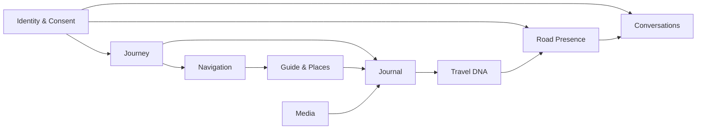

# DDD e bounded context di Travel DNA

## Perché usare DDD

Travel DNA contiene parole che sembrano appartenere allo stesso oggetto
`Trip`, ma hanno regole e lifecycle differenti: route, diario, messaggio,
consenso, luogo, presenza, fotografia e navigatore.

DDD strategico serve a evitare un modello unico gigantesco e a costruire un
linguaggio condiviso. Non obbliga a usare microservizi né a riempire ogni modulo
di pattern complessi.

## Principio

> Un bounded context possiede il significato e le invarianti del proprio modello.
> Gli altri context comunicano tramite contratti espliciti, eventi o read model.

## Context map iniziale



Le frecce non significano dipendenza di codice diretta. Indicano che un context
consuma fatti o riferimenti prodotti da un altro.

## Journey Context

Possiede:

- `Trip`;
- partecipanti e ruoli;
- sessione attiva;
- tappe pianificate;
- eventi di partenza, sosta e conclusione;
- stato generale del viaggio.

Non possiede:

- algoritmo di routing;
- rendering della mappa;
- contenuto delle conversazioni;
- file delle fotografie.

Invarianti candidate:

- una sessione attiva appartiene a un solo viaggio;
- ogni evento ha tempo monotono nel journal locale o una policy esplicita per gli
eventi tardivi;
- i ruoli sono versionati e revocabili;
- la fine della sessione non implica la pubblicazione del diario.

## Journal Context

Possiede:

- `JourneyMoment`;
- `DailyPage`;
- pensieri e note vocali;
- associazione narrativa con foto e luoghi;
- stato bozza/confermato;
- visibilità del momento.

Non possiede la traccia GPS grezza come unico modello. Consuma eventi del viaggio
e riferimenti media.

Invarianti:

- una foto non diventa pubblica perché è stata associata;
- una Pagina del giorno può essere rigenerata senza perdere modifiche manuali;
- le correzioni dell'utente prevalgono sulle inferenze automatiche;
- il diario completo non è una Cartolina DNA.

## Navigation Context

Possiede:

- richiesta di route canonica;
- selezione del modo di navigazione;
- route interna o percorso ombra;
- progresso;
- manovre;
- confidenza;
- deviazione e ricalcolo;
- snapshot pubblicato.

Non possiede:

- marker MapLibre;
- deep link Waze concreto;
- testi del diario;
- logica di matching sociale.

Invarianti:

- il provider non esce dal boundary;
- una route attiva è immutabile fino a sostituzione controllata;
- un ricalcolo non cancella la route precedente prima di avere un risultato
valido;
- il navigatore esterno resta autorità quando attivo;
- il percorso ombra non produce istruzioni vincolanti.

## Guide and Places Context

Possiede:

- `TravelDnaPlaceId`;
- categorie canoniche;
- provenienza;
- contenuto editoriale;
- informazione pratica;
- relazioni con OSM/Wikidata/partner;
- disponibilità e freschezza.

Invarianti:

- un luogo Travel DNA non coincide con l'ID di un provider;
- la provenienza e la licenza restano disponibili;
- dati editoriali e contenuti utenti non vengono confusi;
- la visita verificata non espone la traccia privata.

## Travel DNA Context

Possiede:

- profilo di preferenze contestuale;
- criteri di compatibilità;
- `DnaCard`;
- ranking e selezione;
- regole di condivisione del frammento.

Invarianti:

- il DNA completo resta privato;
- una Cartolina contiene solo campi autorizzati;
- il matching può spiegare almeno a grandi linee perché un consiglio è rilevante;
- preferenze sensibili non vengono inferite senza base e consenso.

## Road Presence Context

Possiede:

- segnale di presenza;
- corridoio, direzione e scadenza;
- aggregazione;
- jitter/ritardo e precisione;
- eleggibilità alle richieste.

Invarianti:

- nessuna coordinata esatta pubblica;
- il segnale scade automaticamente;
- blocco e invisibilità si applicano prima della scoperta;
- un identificatore effimero non diventa profilo permanente.

## Conversations Context

Possiede:

- saluti;
- conversazioni;
- messaggi;
- domande di strada;
- Carovane;
- ricevute;
- blocchi e segnalazioni;
- politiche per la modalità di guida.

Invarianti:

- un saluto non apre automaticamente una relazione;
- le richieste possono scadere;
- il server conserva la responsabilità di consegna, non il processo in
background del telefono;
- l'interfaccia conducente e quella passeggero hanno capability diverse;
- il blocco impedisce nuovi contatti e presenza reciproca secondo policy.

## Identity and Consent Context

Possiede:

- account;
- pseudonimo;
- età e verifiche necessarie;
- ruoli;
- consensi;
- visibilità;
- revoca;
- cancellazione e export.

È un context trasversale ma non deve diventare un oggetto globale passato ovunque.
Gli altri moduli ricevono decisioni strette, per esempio `SharingPolicySnapshot`.

## Media Context

Possiede:

- file e miniature;
- metadati;
- import da galleria;
- upload;
- rimozione EXIF;
- note vocali;
- stato locale/remoto.

Non decide da solo la visibilità narrativa o DNA.

## Context di supporto

- Search and Discovery;
- Notifications;
- Analytics and Observability;
- Moderation;
- Licensing and Provenance;
- Feature Configuration.

## Aggregate eccessivi da evitare

Non creare:

```text
Trip {
  route,
  map,
  messages,
  users,
  photos,
  places,
  permissions,
  provider,
  traffic,
  diary
}
```

Un oggetto simile produce transazioni, dipendenze e ricostruzioni incontrollabili.
Meglio identificatori stabili, eventi e read model specifici.

## Eventi di dominio candidati

```text
TripCreated
TripSessionStarted
ExternalNavigationLaunched
RoutePlanned
NavigationStarted
ShadowRouteConfidenceChanged
StopDetected
PlaceVisitProposed
PhotoAttachedToMoment
ThoughtAdded
DailyPageComposed
DnaCardPublished
PresenceActivated
GreetingSent
GreetingReciprocated
ConversationOpened
MessageReceived
VoiceReplySent
TripDayClosed
TripCompleted
```

Gli eventi non vanno introdotti tutti subito. Ogni evento deve avere un consumer
reale o un valore di audit/test.

## DDD tattico con moderazione

Usare value object e aggregate dove proteggono invarianti. Non creare repository,
factory e domain service per semplici DTO senza regole.

Domanda guida:

> Questa struttura rende esplicita una regola reale o aggiunge soltanto cerimonia?

## Event Storming iniziale

Per una vertical slice, disporre:

```text
comandi -> eventi -> policy -> read model -> rischi -> test
```

Esempio:

```text
StartTrip
-> TripSessionStarted
-> StartJourneyRecording
-> PublishRoadPresence
-> LaunchExternalNavigator
-> show Companion status
```

Aggiungere accanto:

- dati personali;
- failure mode;
- timeout;
- provider;
- scenario Lab.
