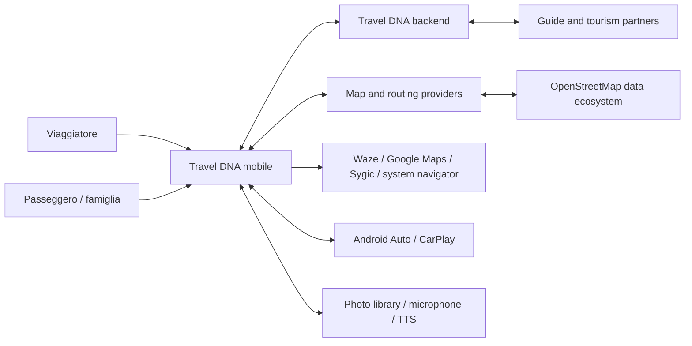
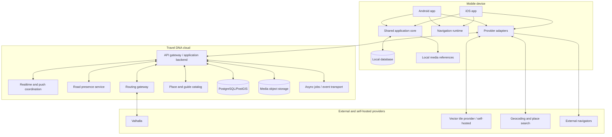
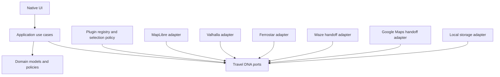
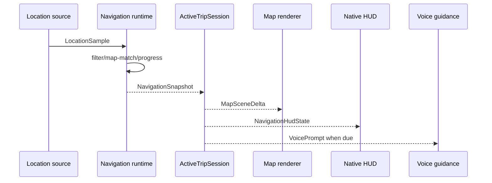
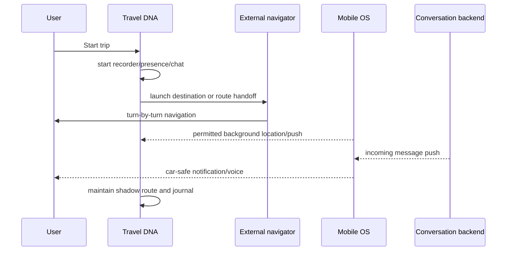

# Architettura generale di Travel DNA

## Obiettivo

Questo capitolo descrive l'architettura software completa a livello di sistema.
Non è un diagramma decorativo: definisce responsabilità, dipendenze ammesse,
percorsi runtime, dati, failure mode e punti in cui misurare le prestazioni.

## Principi fondamentali

```text
1. Il dominio dipende da contratti Travel DNA, non da provider.
2. Navigazione interna ed esterna sono entrambe modalità di prima classe.
3. La UI critica resta nativa e la mappa è una superficie persistente.
4. Il loop di navigazione è isolato da chat, media, database e rete.
5. Lo stato locale è la base della reattività e della resilienza.
6. Posizione e identità sono minimizzate prima della condivisione.
7. Le astrazioni devono comprare valore misurabile.
8. L'architettura deve essere spiegabile tramite replay e scenari Lab.
```

## Vista di contesto



### Confini di fiducia

- il telefono contiene il diario privato e consensi locali;
- il backend gestisce account, sincronizzazione, messaggi e presenza;
- provider cartografici ricevono soltanto i dati necessari alla richiesta;
- navigatori esterni ricevono destinazione e opzioni supportate, non il diario;
- altri utenti vedono dati approssimati e frammenti autorizzati;
- Android Auto e CarPlay applicano template e regole proprie.

## Vista dei container



## Mobile application

### Native presentation layer

Android:

- Kotlin;
- Jetpack Compose per HUD e schermate;
- `MapView` MapLibre nativa ospitata in modo persistente;
- lifecycle Android, foreground service e Android Auto;
- TTS e notifiche native.

iOS:

- Swift;
- SwiftUI per shell e schermate;
- UIKit/MapLibre view per il rendering critico;
- Core Location, PhotoKit, AVSpeechSynthesizer;
- ActivityKit e CarPlay.

La UI non contiene regole di dominio. Consuma presentation model compatti e
produce intent utente.

### Shared application core

Responsabilità candidate:

- use case di viaggio e diario;
- orchestrazione della sessione;
- contratti canonici;
- policy di selezione provider;
- privacy e consenso applicativo;
- sincronizzazione local-first;
- state machine non grafiche;
- presentation model condivisibili.

Il core non deve entrare nel rendering a 60 fps né attraversare continuamente
bridge costosi.

### Navigation runtime

Responsabilità:

```text
LocationSample
-> validation/filtering
-> map matching
-> route progress
-> maneuver selection
-> off-route detection
-> reroute coordination
-> NavigationSnapshot
```

Inizialmente può essere implementato dall'adapter Ferrostar. Il contratto resta
Travel DNA e una futura implementazione Rust può sostituirlo.

### Local data layer

Contiene:

- viaggio attivo;
- route e snapshot necessari;
- diario e modifiche;
- conversazioni recenti;
- code di invio;
- cache POI e guide;
- consensi e impostazioni;
- stato di sincronizzazione.

La UI legge da qui o da state holder alimentati da qui. Non attende il server per
ogni azione.

## Backend

### Scelta iniziale: monolite modulare

Il backend inizia come un deployable unico con moduli separati. I bounded context
non implicano microservizi immediati.

Moduli:

```text
identity-consent
trip-journey
journal-sync
conversation
road-presence
travel-dna
places-guide
routing-gateway
media-metadata
moderation
notifications
observability
```

Valhalla, database, object storage e code possono essere processi separati perché
hanno runtime e scaling diversi.

### Perché non microservizi subito

- meno failure mode distribuiti;
- transazioni e migrazioni più semplici;
- ambiente didattico più accessibile;
- tracing e debug iniziali più chiari;
- possibilità di separare in futuro attraverso confini già documentati.

Un modulo viene estratto solo quando esiste un motivo: carico, sicurezza,
ownership di team, deployment indipendente o tecnologia necessaria.

## Contratti e modelli canonici

Esempi:

```kotlin
data class GeoPoint(
    val latitudeDegrees: Double,
    val longitudeDegrees: Double
)

data class RouteRequest(
    val origin: GeoPoint,
    val destination: GeoPoint,
    val waypoints: List<GeoPoint>,
    val profile: TravelProfile,
    val preferences: RoutePreferences
)

data class RoutePlan(
    val id: RouteId,
    val geometry: RouteGeometry,
    val distanceMeters: Long,
    val durationSeconds: Long,
    val legs: List<RouteLeg>,
    val provenance: DataProvenance
)
```

Non includono:

- `ValhallaResponse`;
- `MapLibreFeature`;
- `FerrostarRoute`;
- `GMSNavigationSession`;
- ID del provider come identità primaria.

## Architettura a porte e adapter



La freccia indica conformità/dipendenza verso i contratti, non che il dominio
chiami direttamente tutti gli adapter.

## Runtime: navigazione interna



Regola: chat e diario non partecipano alla computazione sincrona dello snapshot.
Ricevono eventi separati.

## Runtime: navigatore esterno



Il percorso ombra è un modello probabilistico. Se la confidenza è bassa, il
sistema riduce la precisione dei suggerimenti.

## Runtime: chat durante la guida

```text
server message
-> push/live signal
-> local conversation store
-> DriveInteractionPolicy
-> Android Auto / CarPlay / phone voice surface
-> voice reply or quick action
-> local outgoing queue
-> server acknowledgement
```

Il messaggio è salvato prima di essere presentato. Una perdita temporanea della
rete non deve cancellare la risposta.

## Runtime: diario

```text
Trip and location events
-> JourneyEventStore
-> Stop/visit candidates
-> Media observations
-> Timeline projector
-> DailyPage draft
-> manual edits
-> optional DnaCard projection
```

Il journal conserva eventi e modifiche in modo da rigenerare una bozza senza
perdere l'intento dell'utente.

## Concorrenza

Corsie logiche:

```text
UI/main
map renderer
navigation actor
realtime conversation actor
journey recorder
local database
media worker
sync worker
```

Principi:

- un solo proprietario mutabile per lo stato di navigazione;
- eventi processati in ordine;
- cancellazione esplicita dei job;
- nessun lock globale tra mappa e chat;
- backpressure e bounded queues per stream ad alta frequenza;
- fotografie elaborate fuori dal main thread;
- database access asincrono e batch dove opportuno.

## Frequenze diverse

| Dato | Frequenza indicativa | Nota |
| --- | --- | --- |
| Animazione puck | 30–60 fps | Interpolazione grafica. |
| Campione GPS | secondo OS e profilo | Non 60 Hz. |
| Route progress | pochi aggiornamenti al secondo | Deterministico. |
| HUD distanza | 2–5 Hz | Evitare rumore. |
| ETA | circa 1 Hz | O quando cambia significativamente. |
| Presenza altri utenti | ogni alcuni secondi | Approssimata e privacy-friendly. |
| POI lungo route | cambio corridoio/zoom | Non a ogni GPS. |
| Diario | eventi significativi | Non stream grafico. |
| Chat | event-driven | Priorità separata. |

## Deployment iniziale

```text
Mobile apps
    -> HTTPS/WebSocket endpoint
    -> modular backend
        -> PostgreSQL/PostGIS
        -> object storage
        -> push providers
        -> routing gateway
            -> Valhalla
        -> vector tile/search provider
```

Ambienti:

- local development con fake provider e fixture;
- integration con servizi containerizzati;
- staging con dati sintetici;
- field beta con utenti autorizzati;
- production con feature flag e rollback.

## Osservabilità

Separare:

- metriche tecniche;
- eventi di dominio;
- telemetria prestazionale;
- audit di consenso;
- log diagnostici;
- analytics di prodotto.

Non loggare per default:

- coordinate precise complete;
- testo privato dei messaggi;
- fotografie;
- token;
- destinazioni sensibili;
- profili DNA completi.

Usare identificatori pseudonimi e sampling. Un tracepoint didattico non diventa
automaticamente telemetria di produzione.

## Failure mode principali

### GPS debole o assente

- mantenere ultimo stato con etichetta di confidenza;
- sospendere indicazioni troppo precise;
- non inventare posizione;
- registrare un gap nel diario.

### Routing provider non disponibile

- usare route cache o provider secondario;
- mantenere route corrente;
- impedire ricalcoli concorrenti;
- mostrare degraded mode.

### Rete assente

- navigazione locale continua se i dati necessari esistono;
- chat e diario entrano in coda;
- presenza può scadere;
- nessun loop aggressivo di retry.

### Map tiles non disponibili

- conservare HUD e guidance;
- mostrare mappa cache o fallback;
- non bloccare la sessione di navigazione.

### Chat in errore

- non deve influire su guidance;
- mostrare stato non inviato;
- retry bounded;
- nessuna duplicazione visibile grazie a idempotency key.

### Backend parzialmente indisponibile

- circuit breaker o policy nel gateway;
- health/capability aggiornate;
- feature flag per disabilitare superfici non sicure.

## Evolution path

```text
fake providers
-> hosted open-source providers
-> self-hosted controlled services
-> Travel DNA libraries in shadow mode
-> partial rollout
-> primary provider with fallback
```

Non si sostituisce una libreria con un big-bang rewrite.

## Domande di review architetturale

1. Quale responsabilità ha cambiato proprietario?
2. Un tipo del provider è uscito dall'adapter?
3. È stata aggiunta una copia o una serializzazione nel percorso caldo?
4. La funzione continua offline o dichiara il degraded mode?
5. Il dato personale è più preciso o conservato più a lungo?
6. Android e iOS ricevono lo stesso significato, anche se la UI è diversa?
7. Esiste un replay o contract test che consente la sostituzione?
8. La documentazione distingue target, stato attuale e roadmap?
