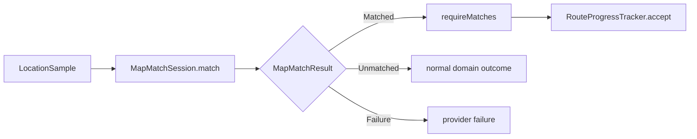
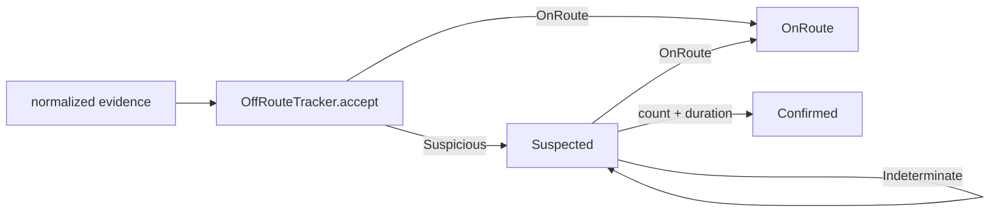
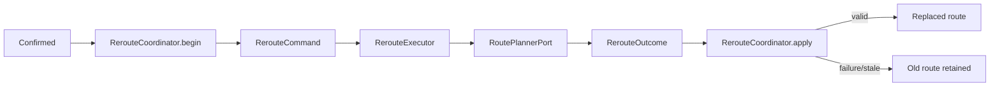

# Mappa del codice e degli stati

## Scopo

Questa mappa mostra percorsi reali ed eseguibili separandoli dalle viste target.
Ogni sezione dichiara ownership, stato mutato e confini.

## 1. Reference routing Java/Rust

```text
reference-network-v0.tdna
-> parser Java / parser Rust
-> RoadGraph
-> Dijkstra o A*
-> predecessor chain
-> route result
-> report byte-identico
```

Stato temporaneo: frontier, best cost e previous. Nessun GPS, provider, rete o UI
entra nel Lab.

## 2. Routing provider-neutral

```text
RouteRequest
-> RoutePlannerPort
-> FakeRoutePlanner
-> RoutePlanningResult
-> RoutePlan
-> RoutePlannerContractProbe
```

| Componente | Possiede |
| --- | --- |
| `RouteRequest` | origine, destinazione, tappe e profilo |
| `RoutePlan` | geometria, leg, manovre e provenance |
| provider | traduzione e comportamento concreto |
| application layer | scelta del provider e fallback |

Il dominio non importa modelli Valhalla, Google, Sygic o altri vendor.

## 3. MapScene e renderer

```text
RoutePlan
-> RouteMapProjector
-> MapScene
-> FakeMapRenderer.install
-> MapSceneDelta
-> FakeMapRenderer.apply
-> snapshot semantico
```

La scena statica viene installata raramente; camera, progress, marker e selezione
usano delta compatti.

## 4. LocationSample e replay

```text
TDNA_LOCATION_REPLAY_V0
-> ReplayFixtureParser JVM
-> LocationSample list
-> DeterministicReplayRunner
   -> LocationSampleGate.inspect
   -> VirtualReplayClock.preview
   -> ReplayDelayScaler.preview
   -> commit atomico
-> ReplaySummary
-> report JSON
```

Stato bounded: next index, contatori, last accepted, clock virtuale, rate
remainder, rejection counts e replay state. Nessuna cronologia illimitata.

## 5. Porta map matching e fake



Function path:

```text
MapMatcherPort.bind(RoutePlan)
-> MapMatchSession.match(LocationSample)
-> exact fake key lookup / real adapter future
-> Matched.requireMatches
-> RouteProgressTracker.accept
```

| Componente | Stato posseduto | Frequenza |
| --- | --- | --- |
| `RoutePlan` | geometria/leg/manovre immutabili | sessione |
| `MapMatchSession` | route legata e futuro stato matcher | sessione |
| `FakeMapMatcher` | catalogo, counter e call window | vita fake |
| `MapMatchResult` | un esito immutabile | campione |

`Unmatched`, provider `Failure` e cancellazione restano distinti.

## 6. Matched position e route progress

```text
MatchedRoutePosition
-> RouteProgressTracker.accept
-> RouteProgressSnapshot
-> RouteProgressMapProjector.project
-> MapSceneDelta.UpdateRouteProgress
-> renderer
```

Il tracker possiede cursori precomputati e l'ultimo snapshot accepted. Usa binary
search per leg/manovra; una regressione non muta lo stato. Route e overlay vengono
verificati una volta nel binding e il delta frequente resta `O(1)`.

## 7. Evidenza off-route e state machine



Function path:

```text
OffRouteTracker.accept
-> route / sequence / monotonic-time validation
-> nextState
-> SuspicionStarted / Continued / Held / Recovered / ConfirmedNow
-> commit only for Accepted
```

| Componente | Stato posseduto | Crescita |
| --- | --- | --- |
| `OffRoutePolicy` | count e durata bounded | costante |
| `OffRouteTracker` | state, accepted baseline, episode counter | costante |
| `OffRouteState.Suspected` | prima e ultima evidenza sospetta, count | costante |
| `OffRouteState.Confirmed` | prima evidenza, conferma, count e durata | costante |

`Indeterminate` aggiorna la baseline accepted ma non il last suspicious sample,
non incrementa il count e non causa recovery.

## 8. Reroute correlato e route replacement



Stati:

```text
Ready(activeRoute, optional lastFailure)
-> InFlight(activeRoute, command)
-> Ready(oldRoute, failure)
oppure
-> Ready(newRoute)
```

Invarianti principali:

- `command.sourceRouteId == activeRoute.id`;
- request destination uguale alla destinazione della route attiva;
- massimo un attempt in flight;
- attempt ID e source route ID devono coincidere nell'outcome;
- il planner deve dichiarare `routing.plan`;
- capability manovre dichiarata implica manovre presenti nelle legs;
- provenance della route uguale al provider selezionato;
- replacement conforme alla request e con nuovo `RouteId`;
- cancellation cleanup prima del rethrow;
- la vecchia route resta autorevole fino al commit della nuova.

Dopo replacement il runtime ricrea almeno:

```text
MapMatchSession
RouteProgressTracker
OffRouteTracker
RouteProgressMapBinding
stato voice/guidance legato alla route
```

## 9. Navigation runtime target

```text
LocationSource
-> sample validation/filter
-> MapMatcherPort session
-> matched/unmatched/failure normalization
-> route progress
-> off-route evidence/state machine
-> reroute coordinator/executor
-> NavigationSnapshot
-> HUD / map delta / voice
```

Il runtime futuro deve avere un owner singolo per route attiva, matcher, progress,
evidenza off-route, tentativo reroute e prompt annunciati.

## 10. Chat durante la guida target

```text
server message
-> push/live signal
-> local sync/store
-> DriveInteractionPolicy
-> voice/car notification oppure full passenger UI
-> outbox
```

## 11. Diario target

```text
JourneyEvent
-> event store
-> stop/visit projection
-> media association
-> DailyPage draft
-> user edits
-> optional DNA card sanitization
```

## 12. Presenza target

```text
exact local sample
-> road context
-> privacy approximation
-> ephemeral TTL signal
-> aggregate companion projection
```

La minimizzazione precede la rete.

## 13. Mappa dati

| Dato | Owner | Persistenza |
| --- | --- | --- |
| `LocationSample` esatto | navigation/journey locale | breve/local |
| `MapMatchSession` | matcher/runtime | sessione |
| `MapMatchResult` | matcher/caller | transiente |
| `MatchedRoutePosition` | matcher/runtime | transiente |
| `RouteProgressSnapshot` | progress tracker | ultimo snapshot |
| `OffRouteState` | off-route tracker | stato corrente |
| `RerouteCommand` | coordinator/executor | un attempt |
| `RoutePlan` | navigation | cache/sessione |
| `MapScene` | presentation/renderer | scena |
| `MapSceneDelta` | presentation | transiente |
| `JourneyEvent` | journey | locale durable |
| `DailyPage` | journal | user durable |
| `PresenceSignal` | presence/backend | TTL breve |
| `Message` | conversation | server/local durable |

## Regola di aggiornamento

Ogni vertical slice aggiunge package/file, entry point, function path, stato e
owner, thread/dispatcher, tracepoint, test, benchmark, issue, PR e report.
Evitare call graph globali illeggibili: generare viste mirate al comportamento.
