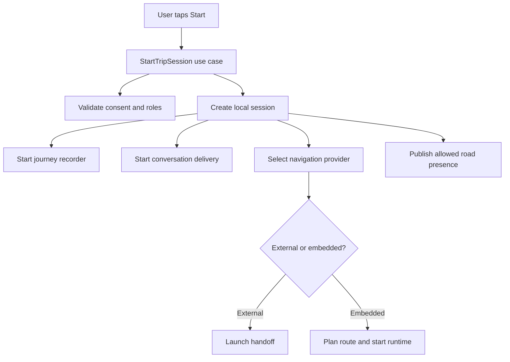
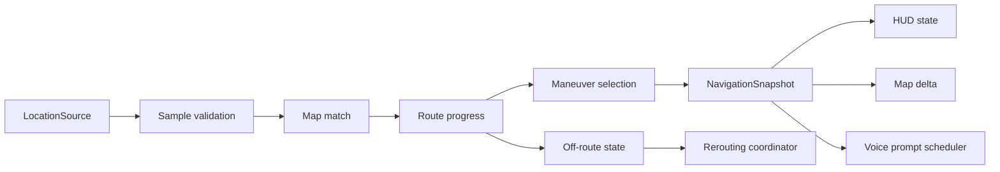
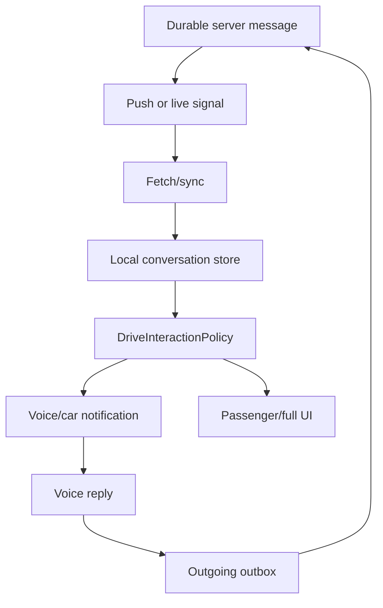
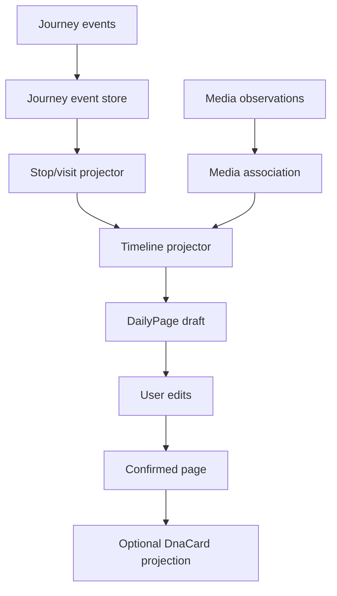

# Mappa del codice e degli stati

## Stato del documento

La codebase non è ancora stata creata. Questo capitolo definisce la mappa logica
che dovrà essere aggiornata con funzioni, package e call graph reali dopo ogni
vertical slice architetturale.

## Obiettivo

Aiutare lo studente a vedere Travel DNA come:

- dati che cambiano forma;
- stati che evolvono;
- responsabilità separate;
- percorsi caldi e percorsi asincroni;
- contratti protetti da test.

## Vista: avvio viaggio



Futuri punti di ingresso da documentare:

```text
StartTripSession.execute()
ConsentPolicy.evaluate()
TripSessionStore.create()
NavigationModeSelector.select()
ExternalNavigationProvider.launch()
NavigationRuntime.start()
```

## Vista: loop navigation



Stato posseduto dal navigation actor:

```text
active route id
route geometry/index
last accepted sample
matched position
progress
current maneuver
announced prompts
off-route state
reroute request id
confidence
```

## Vista: mappa

```text
MapScene installed once
  base style
  route geometry
  static layers

MapSceneDelta repeated
  puck position
  completed range
  camera
  presence add/update/remove
  selected POI
```

Il renderer possiede handle e layer del provider; il core possiede solo ID e
delta canonici.

## Vista: chat



State ownership:

- server: durable accepted order;
- local DB: cached conversation/outbox;
- surface: transient presentation;
- policy: allowed capability;
- navigator: unrelated, no dependency on message body.

## Vista: diario



## Vista: presenza

```text
precise sample local
-> road context
-> privacy approximation
-> ephemeral signal
-> backend TTL store
-> aggregation/matching
-> approximate companion projection
```

La funzione di privacy precede la trasmissione.

## State machine principali

### Trip session

```text
CREATED
-> STARTING
-> ACTIVE
-> PAUSED optional
-> ENDING
-> COMPLETED
-> FAILED_START
```

### Navigation

```text
IDLE
-> ROUTE_READY
-> NAVIGATING
-> SUSPECTED_OFF_ROUTE
-> CONFIRMED_OFF_ROUTE
-> REROUTING
-> NAVIGATING
-> ARRIVED
```

### Shadow route confidence

```text
UNKNOWN -> HIGH -> MEDIUM -> LOW -> UNKNOWN
```

Transizioni possono risalire quando una nuova route torna coerente.

### Message

```text
DRAFT -> QUEUED -> SENDING -> ACCEPTED
                         \-> FAILED_RETRYABLE
                         \-> FAILED_PERMANENT
```

### Presence

```text
DISABLED -> STARTING -> ACTIVE -> EXPIRING -> EXPIRED
                       \-> SUSPENDED
```

### Daily page

```text
NOT_CREATED -> AUTO_DRAFT -> USER_EDITED -> CONFIRMED -> ARCHIVED
```

## Mappa dati

| Dato | Owner | Lettori | Persistenza |
| --- | --- | --- | --- |
| Exact LocationSample | Navigation/Journey local | nav, recorder | breve/local |
| RoutePlan | Navigation | map, guide | cache/local/server optional |
| NavigationSnapshot | Navigation runtime | UI/voice | transient/snapshot |
| JourneyEvent | Journey | Journal projector | local durable |
| DailyPage | Journal | UI/export | user durable |
| PresenceSignal | Presence | backend matching | short TTL |
| Message | Conversation | UI/car | server/local durable |
| DnaCard | Travel DNA | recipients | revocable |
| Place | Guide | map/journal | catalog/cache |

## Aggiornamento futuro

Quando esiste codice, aggiungere per ogni scenario:

- package e file;
- entry point;
- helper principali;
- struct/class mutate;
- thread/dispatcher;
- tracepoint;
- test;
- benchmark;
- link commit.

Evitare call graph globali illeggibili. Generare viste mirate.
