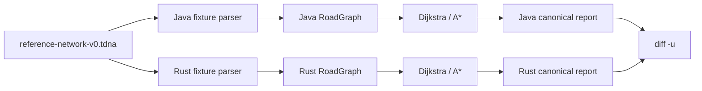
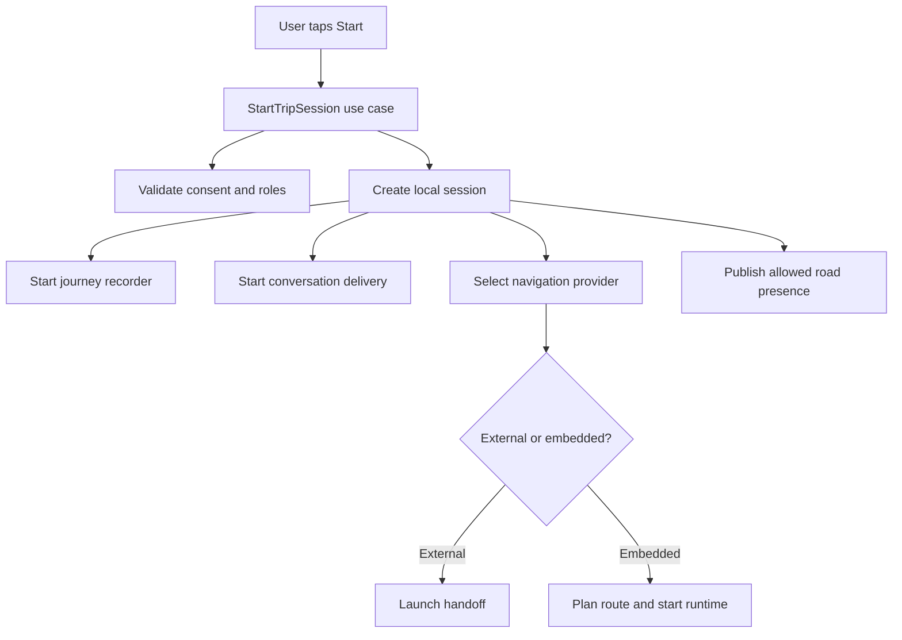
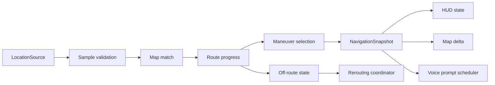
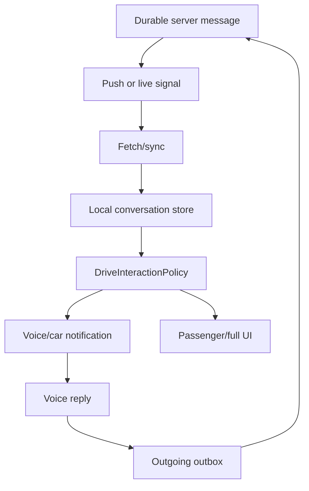
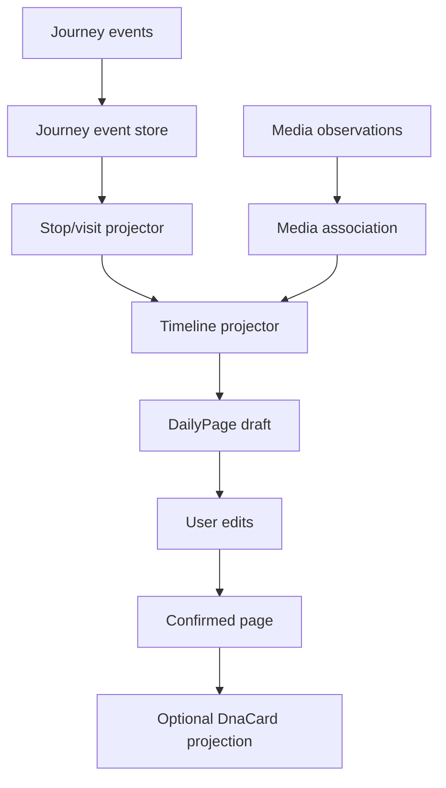

# Mappa del codice e degli stati

## Stato del documento

La mappa contiene ora due livelli distinti:

- un percorso reale ed eseguibile per il routing di riferimento Java/Rust;
- le mappe target dei futuri runtime mobile, chat, diario e presenza.

Le sezioni target non devono essere lette come codice già disponibile. Il
[capitolo sullo stato delle funzionalità](12-stato-funzionalita.md) indica quali
percorsi sono soltanto documentali.

## Obiettivo

Aiutare lo studente a vedere Travel DNA come:

- dati che cambiano forma;
- stati che evolvono;
- responsabilità separate;
- percorsi caldi e percorsi asincroni;
- contratti protetti da test.

## Percorso reale: routing di riferimento

### Vista comune



### Percorso Java

```text
ReferenceRoutingCli.main()
-> ReferenceFixtureParser.parse()
-> RoadGraph.addNode()/addBidirectionalRoad()
-> DijkstraRouter oppure AStarRouter
-> AbstractBestFirstRouter.route()
-> reconstructPath()
-> RouteReport.canonicalLine()
```

Responsabilità:

| Componente | Responsabilità | Stato modificato |
| --- | --- | --- |
| `ReferenceFixtureParser` | Validare sintassi, versione, query e ground truth. | Costruisce scenario e grafo. |
| `RoadGraph` | Possedere nodi e liste di adiacenza ordinate. | Mutabile solo durante il caricamento. |
| `AbstractBestFirstRouter` | Eseguire best-first search deterministica. | `frontier`, `bestCost`, `previous`. |
| `DijkstraRouter` | Fornire euristica zero. | Nessuno stato aggiuntivo. |
| `AStarRouter` | Fornire distanza WGS84 floored. | Nessuno stato aggiuntivo. |
| `RouteReport` | Produrre una riga JSON fixture-scoped. | Nessuno. |

### Percorso Rust

```text
main()
-> parse_fixture()
-> RoadGraph::add_node()/add_bidirectional_road()
-> route()
-> heuristic_metres()
-> reconstruct_path()
-> canonical_report()
```

La crate usa:

- `BTreeMap` per stato con ordine stabile;
- `BinaryHeap` con ordinamento invertito per estrarre la priorità minima;
- `checked_add` per intercettare overflow;
- nessuna dipendenza esterna;
- nessun blocco `unsafe`.

### Percorso degli strumenti

```text
sh tools/tdna check
-> check_docs.py
-> javac + Java test suite
-> cargo fmt + cargo test
-> Java/Rust report
-> diff -u
```

### Stato dell'algoritmo

```text
fixture text
-> parsed graph
-> best_cost[origin] = 0
-> frontier seeded
-> node selected
-> outgoing edges relaxed
-> destination reached
-> predecessor chain reversed
-> route result
-> deterministic report
```

Questo percorso non contiene GPS, provider, rete, database o UI. È la prima
mappa di codice verificabile del repository.

## Vista: avvio viaggio



Futuri punti di ingresso da documentare:

```text
StartTripSession.execute()
ConsentPolicy.evaluate()
TripSessionStore.create()
NavigationModeSelector.select()
ExternalNavigationProvider.launch()
NavigationRuntime.start()
```

## Vista: loop navigation



Stato posseduto dal navigation actor:

```text
active route id
route geometry/index
last accepted sample
matched position
progress
current maneuver
announced prompts
off-route state
reroute request id
confidence
```

## Vista: mappa

```text
MapScene installed once
  base style
  route geometry
  static layers

MapSceneDelta repeated
  puck position
  completed range
  camera
  presence add/update/remove
  selected POI
```

Il renderer possiede handle e layer del provider; il core possiede solo ID e
delta canonici.

## Vista: chat



State ownership:

- server: durable accepted order;
- local DB: cached conversation/outbox;
- surface: transient presentation;
- policy: allowed capability;
- navigator: unrelated, no dependency on message body.

## Vista: diario



## Vista: presenza

```text
precise sample local
-> road context
-> privacy approximation
-> ephemeral signal
-> backend TTL store
-> aggregation/matching
-> approximate companion projection
```

La funzione di privacy precede la trasmissione.

## State machine principali

### Trip session

```text
CREATED
-> STARTING
-> ACTIVE
-> PAUSED optional
-> ENDING
-> COMPLETED
-> FAILED_START
```

### Navigation

```text
IDLE
-> ROUTE_READY
-> NAVIGATING
-> SUSPECTED_OFF_ROUTE
-> CONFIRMED_OFF_ROUTE
-> REROUTING
-> NAVIGATING
-> ARRIVED
```

### Shadow route confidence

```text
UNKNOWN -> HIGH -> MEDIUM -> LOW -> UNKNOWN
```

Transizioni possono risalire quando una nuova route torna coerente.

### Message

```text
DRAFT -> QUEUED -> SENDING -> ACCEPTED
                         \-> FAILED_RETRYABLE
                         \-> FAILED_PERMANENT
```

### Presence

```text
DISABLED -> STARTING -> ACTIVE -> EXPIRING -> EXPIRED
                       \-> SUSPENDED
```

### Daily page

```text
NOT_CREATED -> AUTO_DRAFT -> USER_EDITED -> CONFIRMED -> ARCHIVED
```

## Mappa dati

| Dato | Owner | Lettori | Persistenza |
| --- | --- | --- | --- |
| Exact LocationSample | Navigation/Journey local | nav, recorder | breve/local |
| RoutePlan | Navigation | map, guide | cache/local/server optional |
| NavigationSnapshot | Navigation runtime | UI/voice | transient/snapshot |
| JourneyEvent | Journey | Journal projector | local durable |
| DailyPage | Journal | UI/export | user durable |
| PresenceSignal | Presence | backend matching | short TTL |
| Message | Conversation | UI/car | server/local durable |
| DnaCard | Travel DNA | recipients | revocable |
| Place | Guide | map/journal | catalog/cache |

## Regola di aggiornamento

Per ogni nuova vertical slice aggiungere:

- package e file;
- entry point;
- helper principali;
- struct/class mutate;
- thread/dispatcher;
- tracepoint;
- test;
- benchmark;
- link commit.

Evitare call graph globali illeggibili. Generare viste mirate.
