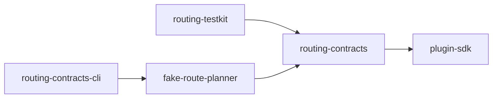

# Contratti di routing neutrali e fake provider Kotlin Multiplatform

## Stato del capitolo

`implementation-backed — Foundations and Travel DNA Lab v0`

Questo capitolo descrive il primo confine di produzione del repository che non è
legato a una libreria cartografica, a un motore di routing o al laboratorio
Java/Rust. Il codice si trova in:

```text
shared/plugin-sdk/
shared/routing-contracts/
shared/routing-testkit/
shared/fake-route-planner/
labs/routing-contracts-cli/
```

Il termine “di produzione” qui indica il **tipo di responsabilità** del modello:
sono contratti pensati per essere usati dall'applicazione e dagli adapter futuri.
Non significa che l'API v0 sia già pubblica, congelata o pronta per un rilascio
mobile.

## Cosa imparerai

Al termine del capitolo dovresti saper spiegare:

1. perché l'algoritmo che trova un percorso non deve coincidere con l'API usata
   dall'app;
2. come un contratto provider-neutral limita il lock-in;
3. la differenza fra porta, adapter, provider e fake;
4. perché `RoutePlan` contiene geometria, legs, manovre e provenance;
5. perché le invarianti vengono controllate alla costruzione;
6. come modellare successi ed errori senza esporre eccezioni del vendor;
7. perché la cancellazione delle coroutine non è un errore del provider;
8. che cosa dichiara un plugin tramite capability;
9. come un testkit riutilizzabile verifica provider differenti;
10. quale valore aggiunge Kotlin Multiplatform e quali costi introduce;
11. perché il fake provider non deve diventare una seconda implementazione di
    produzione;
12. come la CI protegge contemporaneamente codice, architettura e documentazione.

## Prerequisiti

Prima di proseguire è utile leggere:

- [DDD e bounded context](10-ddd-bounded-context.md);
- [Architettura generale](20-architettura-generale.md);
- [Architettura plugin e provider](22-architettura-plugin-provider.md);
- [Routing e navigazione](24-routing-e-navigazione.md);
- [Primo routing Java/Rust](43-reference-routing-java-rust.md).

Il laboratorio Java/Rust insegna come si calcola una route su un piccolo grafo.
Questo capitolo risponde a una domanda diversa:

> Quale forma deve avere una richiesta e una risposta di routing affinché il
> resto di Travel DNA non dipenda dall'implementazione scelta oggi?

## Dal laboratorio al contratto applicativo

La slice precedente aveva questo percorso:

```text
fixture didattica
-> parser Java o Rust
-> RoadGraph
-> Dijkstra / A*
-> RouteResult
-> report del Lab
```

Quel modello è ottimo per studiare un algoritmo. È insufficiente come API
applicativa perché non rappresenta:

- profilo di viaggio;
- tappe intermedie;
- route alternative;
- legs;
- manovre;
- durata;
- provenienza del risultato;
- capability del provider;
- errori classificati;
- sostituzione di provider.

Sarebbe anche pericoloso trasformarlo direttamente nel modello mobile. Il fatto
che un tipo sia già presente nel repository non lo rende automaticamente il
confine corretto.

La separazione scelta è:

```text
algoritmo / provider specifico
        |
        v
adapter di routing
        |
        v
RoutePlannerPort + modelli canonici Travel DNA
        |
        v
use case applicativi, UI, diario e guida
```

Il laboratorio resta una reference implementation. I futuri adapter potranno
usare:

- Valhalla;
- un routing engine locale;
- un servizio commerciale;
- un futuro core Rust Travel DNA;
- fixture e fake durante i test.

Tutti devono tradurre il proprio risultato nei modelli del contratto.

## I cinque moduli della slice

### `shared/plugin-sdk`

Contiene concetti comuni a tutti i plugin:

```text
PluginId
CapabilityId
PlatformId
LicenseNotice
PluginDescriptor
TravelDnaPlugin
```

Non conosce il routing. Potrà essere usato anche da renderer, sorgenti traffico,
media store, navigatori esterni e superfici automobilistiche.

### `shared/routing-contracts`

Contiene il linguaggio canonico del routing:

```text
GeoPoint
RouteId
RouteRequest
RoutingProfile
RoutePlan
RouteLeg
RouteManeuver
RouteProvenance
RoutePlanningResult
RoutePlanningError
RoutePlannerPort
RoutingCapabilities
```

Dipende soltanto da Kotlin e dal plugin SDK.

### `shared/routing-testkit`

Contiene controlli riutilizzabili per le implementazioni di
`RoutePlannerPort`. Il testkit non calcola percorsi: verifica che il provider
rispetti il contratto.

### `shared/fake-route-planner`

È un provider deterministico, in memoria e senza I/O. Serve per:

- unit test applicativi;
- esempi;
- Lab;
- contract test;
- sviluppo prima dei provider reali.

### `labs/routing-contracts-cli`

È una piccola applicazione JVM che esegue il fake e stampa un riepilogo stabile.
Rende il confine osservabile senza Android Studio o Xcode.

## Direzione delle dipendenze



La direzione è intenzionale:

- il contratto non conosce il fake;
- il contratto non conosce il testkit;
- il fake dipende dal contratto;
- l'applicazione Lab dipende da una implementazione concreta soltanto nel suo
  composition root;
- nessun modulo shared importa tipi del Lab Java/Rust.

Questa è una prima applicazione concreta della dependency inversion.

## Kotlin Multiplatform: perché viene introdotto qui

Nel laboratorio precedente Java e Rust erano sufficienti. Ora esiste il primo
contratto che dovrà essere condiviso fra Android e iOS. Kotlin Multiplatform
permette di scrivere una volta:

- modelli;
- validazioni;
- porte;
- capability;
- fake;
- contract test;
- parte della logica applicativa.

La slice configura due target verificabili in CI:

```text
JVM
Linux x64
```

Il target JVM serve a:

- eseguire test rapidamente;
- integrare la CLI;
- preparare Android;
- dimostrare interoperabilità con Java.

Il target Linux Native serve come primo controllo che il codice `commonMain`
non contenga accidentalmente dipendenze JVM. Non sostituisce ancora i target iOS,
che richiederanno un runner macOS e Xcode.

### Perché non condividere subito tutta la UI

Il contratto è condiviso; la schermata di navigazione resterà nativa. MapLibre,
Android Auto, CarPlay, lifecycle, permessi e rendering hanno confini fortemente
specifici della piattaforma. La condivisione viene usata dove compra coerenza e
testabilità, non come obiettivo ideologico.

## Bootstrap Gradle

La root contiene:

```text
settings.gradle.kts
build.gradle.kts
gradle/libs.versions.toml
gradle.properties
```

Le versioni iniziali sono centralizzate nel version catalog. La CI usa una
versione esatta di Gradle e non la parola `latest`.

Nella slice corrente:

```text
Kotlin: 2.4.0
Gradle: 9.5.1
Java toolchain: 21
```

### Debito dichiarato: Gradle Wrapper

La best practice finale è committare il Gradle Wrapper, compreso il piccolo JAR
di bootstrap, e verificare la checksum della distribuzione. Durante questa
slice la CI installa esplicitamente Gradle `9.5.1` tramite l'action ufficiale,
mentre l'esecuzione locale richiede un comando `gradle` compatibile già
installato.

Questa soluzione è riproducibile in CI ma non è ancora l'esperienza locale
finale per gli studenti. Prima del bootstrap Android/KMP completo dovremo
aggiungere:

```text
gradlew
gradlew.bat
gradle/wrapper/gradle-wrapper.properties
gradle/wrapper/gradle-wrapper.jar
checksum e procedura di aggiornamento
```

Il debito è documentato invece di essere nascosto.

## Il plugin SDK

### Identificatori namespaced

Gli identificatori usano una forma come:

```text
org.traveldna.fake-route-planner
routing.plan
mobile.android
```

La forma namespaced riduce collisioni e rende i log comprensibili. Gli
identificatori non sono etichette UI: sono token tecnici stabili.

### `PluginDescriptor`

Un descriptor dichiara:

```text
id
implementationVersion
contractVersion
capabilities
supportedPlatforms
licenseNotices
```

Il descriptor risponde a domande diverse:

- **chi sei?** `PluginId`;
- **quale build stai usando?** `implementationVersion`;
- **quale versione del contratto implementi?** `contractVersion`;
- **che cosa sai fare?** capability;
- **dove puoi essere eseguito?** platform;
- **quali notice devono accompagnarti?** licenze.

Non basta controllare il nome del provider. Il codice applicativo dovrebbe
chiedere una capability:

```text
supporta routing.alternatives?
supporta routing.offline?
supporta routing.maneuvers?
```

Non dovrebbe contenere condizioni come:

```text
if provider == VALHALLA
if provider == SYGIC
```

salvo che il composition root debba selezionare esplicitamente una
implementazione.

## `RouteRequest`

La richiesta minima contiene:

```kotlin
RouteRequest(
    origin = ...,
    destination = ...,
    waypoints = ...,
    profile = RoutingProfile.Driving,
    requestedAlternatives = 1,
)
```

### Invarianti

| Regola | Motivo |
| --- | --- |
| coordinate finite e nei limiti WGS84 | impedire dati impossibili; |
| alternative fra 1 e 3 | evitare richieste non bounded nella v0; |
| punti consecutivi differenti | una leg di lunghezza zero è ambigua; |
| liste copiate/immutabili per convenzione data class | ridurre mutazioni a distanza. |

La richiesta non contiene ancora:

- avoid tolls;
- altezza o peso camper;
- preferenze panoramiche;
- accessibilità;
- tempo di partenza;
- traffico;
- energia del veicolo;
- policy Travel DNA.

Questi campi verranno aggiunti quando esiste un caso d'uso e un adapter che può
interpretarli. Inserirli ora sarebbe design speculativo.

## `RoutePlan`

Una route non è soltanto una polilinea. Il contratto v0 contiene:

```text
RouteId
geometry
legs
distanceMeters
durationSeconds
provenance
```

### Geometry

È una lista ordinata di `GeoPoint`:

```text
index 0 -> origine
index 1 -> punto intermedio
...
index N -> destinazione
```

Gli indici permettono a legs e manovre di riferirsi alla geometria senza
copiarla.

### Legs

Una leg descrive una porzione contigua della route:

```text
geometryStartIndex
geometryEndIndex
origin
destination
distanceMeters
durationSeconds
maneuvers
```

Con una tappa intermedia, due legs possono condividere il punto di confine:

```text
leg 0: indici 0..42
leg 1: indici 42..87
```

Le legs devono coprire tutta la geometria senza buchi e nell'ordine corretto.

### Maneuvers

Ogni manovra contiene:

```text
geometryIndex
type
location
instruction
roadName opzionale
exitNumber opzionale
```

La manovra riferisce un punto esistente della geometria. Il costruttore verifica
che:

- l'indice sia nella leg;
- la location coincida con il punto indicizzato;
- le manovre siano ordinate;
- l'istruzione non sia vuota.

Questi controlli impediscono bug in cui UI, voce e mappa descrivono posizioni
diverse.

### Totali

La route deve rispettare:

```text
route.distance = somma checked delle distance delle legs
route.duration = somma checked delle duration delle legs
```

“Checked” significa che un overflow non viene ignorato. Un modello incoerente
viene rifiutato subito, invece di produrre un ETA o una distanza corrotti.

## Provenance

`RouteProvenance` registra almeno:

```text
providerId
providerRouteId opzionale
dataSources
```

La provenance serve a:

- diagnosticare quale adapter ha prodotto la route;
- confrontare provider in shadow mode;
- applicare attribuzioni;
- capire se una route arriva da dati online, offline o sintetici;
- evitare che un risultato venga percepito come “verità senza origine”.

La provenance non deve diventare un contenitore arbitrario di JSON vendor.
Informazioni esterne necessarie devono essere tradotte in campi canonici o
conservate in diagnostica confinata all'adapter.

## Risultato ed errori

Il metodo non restituisce `null` e non espone l'eccezione HTTP del provider.
Restituisce:

```text
RoutePlanningResult.Success(routes)
RoutePlanningResult.Failure(error)
```

Gli errori v0 sono classificati:

```text
InvalidRequest
NoRoute
UnsupportedProfile
ProviderUnavailable
Timeout
RateLimited
Internal
```

Ogni errore dichiara:

- codice stabile;
- messaggio diagnostico bounded;
- retryable sì/no;
- codice diagnostico provider opzionale.

`InvalidRequest` e `NoRoute` non possono essere marcati retryable: ripetere la
stessa richiesta senza modificarla non risolve il problema.

### Perché non usare soltanto eccezioni

Le eccezioni sono adatte a:

- cancellazione;
- bug di programmazione;
- violazioni impreviste dell'ambiente;
- failure non modellate.

Gli esiti operativi previsti appartengono al contratto. Il chiamante deve poter
scrivere una policy esplicita:

```text
NoRoute -> chiedi di modificare tappe
RateLimited -> usa fallback o attendi
ProviderUnavailable -> prova provider secondario
UnsupportedProfile -> disabilita opzione
```

### Cancellazione

`RoutePlannerPort.plan` è `suspend`. Se la coroutine viene cancellata perché
l'utente cambia destinazione o chiude la sessione, l'implementazione deve
lasciare propagare la cancellazione.

Non deve tradurla in:

```text
RoutePlanningError.Internal
RoutePlanningError.ProviderUnavailable
```

La cancellazione non significa che il provider è guasto; significa che il
chiamante non desidera più il risultato.

## Perché la porta è `suspend`

Un provider reale può richiedere:

- rete;
- accesso a un motore locale;
- lettura di grafi offline;
- cancellazione;
- timeout;
- thread dedicati.

La porta è asincrona fin dall'inizio, ma il fake corrente restituisce
immediatamente. Questo consente di testare la forma corretta senza aggiungere
I/O.

Non è stato introdotto un tipo `Future` vendor-specifico e non è stato aggiunto
un callback annidato. Le coroutine restano un meccanismo del linguaggio, non una
semantica del provider.

## Il fake provider

`FakeRoutePlanner` riceve un catalogo:

```text
RouteRequest -> List<RoutePlan>
```

Quando riceve una richiesta:

1. la registra in `recordedRequests`;
2. cerca una corrispondenza esatta;
3. limita il risultato al numero di alternative richiesto;
4. restituisce `Success`;
5. se la richiesta non esiste, restituisce `NoRoute` con codice
   `fake.catalog-miss`.

### Perché matching esatto

Il fake non deve simulare male un router. Deve essere prevedibile. Se iniziasse a
calcolare distanze, scegliere profili o interpretare toll roads, diventerebbe una
seconda implementazione incompleta e ingannevole.

Il catalogo esatto consente a un test di dichiarare:

```text
data questa richiesta
restituisci precisamente questa route
```

### Perché registra le chiamate

Un use case deve poter verificare:

- quante richieste sono state inviate;
- con quali waypoint;
- quale profilo;
- se è stato richiesto un reroute duplicato;
- se l'alternativa è stata inoltrata correttamente.

La registrazione è una funzione di test. Il fake è documentato come
single-threaded e non promette concorrenza di produzione.

## La fixture canonica del fake

`FakeRouteFixtures` riusa concettualmente il percorso del Lab precedente:

```text
A -> C -> D -> E
3600 metri
240 secondi
```

Ma non importa `RoadGraph`, `RouteResult` o classi Java/Rust. Costruisce invece:

```text
RouteRequest
RoutePlan
RouteLeg
RouteManeuver
RouteProvenance
```

Questo passaggio mostra la differenza fra:

- **stesso scenario concettuale**;
- **modelli appartenenti a livelli diversi**.

Una futura integrazione potrebbe avere un adapter esplicito dal risultato di un
core Rust al `RoutePlan`, ma il contratto non importerà mai i tipi interni del
core.

## Il testkit

`RoutePlannerContractProbe` verifica proprietà comuni:

1. il descriptor dichiara `routing.plan`;
2. una richiesta routable restituisce un successo;
3. il numero di alternative non supera la richiesta;
4. origine e destinazione coincidono;
5. la provenance coincide con il plugin;
6. se il provider dichiara `routing.deterministic`, due chiamate uguali danno
   lo stesso risultato;
7. una richiesta dichiarata non routable produce `NoRoute` non retryable.

Il testkit non presuppone che ogni coordinata al mondo sia irraggiungibile. Il
caller fornisce una richiesta che sa essere non routable per la fixture del
provider testato.

Quando introdurremo Valhalla, un adapter test potrà usare un piccolo grafo di
test controllato e lo stesso probe.

## Architecture check

`tools/check_architecture.py` scansiona gli import dei moduli shared e applica
regole semplici:

```text
plugin-sdk          -> Kotlin only
routing-contracts   -> Kotlin + plugin-sdk
routing-testkit     -> Kotlin + plugin-sdk + contracts
fake planner        -> Kotlin + plugin-sdk + contracts + testkit
```

Cerca inoltre token vietati come:

```text
maplibre
valhalla
ferrostar
google.maps
waze
sygic
org.traveldna.reference.routing
```

Questo controllo non sostituisce il dependency graph di Gradle o una review.
Protegge però da una regressione frequente: importare rapidamente un tipo vendor
nel contratto “solo per comodità”.

## CLI del laboratorio

Il comando:

```bash
sh tools/tdna lab routing-contracts
```

esegue il fake provider e produce un riepilogo simile a:

```json
{"provider":"org.traveldna.fake-route-planner","capabilities":["routing.alternatives","routing.deterministic","routing.maneuvers","routing.offline","routing.plan"],"result":"success","route_id":"reference-route-v0","geometry_points":4,"maneuvers":4,"distance_m":3600,"duration_s":240}
```

Il report dimostra:

- quale plugin è stato selezionato;
- quali capability dichiara;
- che il risultato è canonico;
- che geometry e maneuvers sono presenti;
- che distanza e durata sono coerenti.

Non è un formato pubblico. È output didattico e diagnostico del Lab.

## Comandi

### Verificare l'architettura

```bash
sh tools/tdna check-architecture
```

### Eseguire test Kotlin Multiplatform

```bash
sh tools/tdna check-kotlin
```

Il comando esegue:

```text
gradle check
-> test JVM
-> test Linux x64
-> build delle dipendenze
-> CLI Lab
```

Gli artifact del report finiscono sotto:

```text
build/kotlin/
```

### Verificare l'intera foundation

```bash
sh tools/tdna check
```

Comprende:

- documentazione;
- confini architetturali;
- Java;
- Rust;
- contract Java/Rust;
- Kotlin Multiplatform;
- fake provider.

## CI

La workflow `Foundation CI` prepara:

```text
Java 21
Gradle 9.5.1
Kotlin 2.4.0 tramite plugin
Rust stable
Python 3 del runner
```

Poi esegue gli stessi comandi del progetto. I log vengono salvati sotto `build/`
e caricati come artifact in caso di failure.

Il fatto che Gradle venga installato dalla CI non autorizza a cambiare versione
senza aggiornare:

- version catalog;
- workflow;
- capitolo;
- test;
- report di compatibilità.

## Invarianti del contratto

| Oggetto | Invariante principale | Errore evitato |
| --- | --- | --- |
| `GeoPoint` | coordinate finite e valide | NaN e posizioni impossibili |
| `RouteRequest` | alternative bounded, punti consecutivi diversi | richieste ambigue o non bounded |
| `RouteManeuver` | indice valido, testo bounded | HUD/voce incoerenti |
| `RouteLeg` | range crescente, durata/distanza positive | segmenti vuoti o disordinati |
| `RoutePlan` | legs contigue e totali checked | geometria con buchi, ETA corrotto |
| `RouteProvenance` | provider esplicito | risultato senza origine |
| `Success` | route non vuote e ID unici | alternative indistinguibili |
| `RoutePlanningError` | classificazione e retry coerenti | retry infinito su NoRoute |
| `PluginDescriptor` | capability e platform non vuote | plugin impossibile da selezionare |

## Alternative considerate

### Esporre direttamente il JSON Valhalla

Vantaggio apparente: meno mapping iniziale.

Svantaggi:

- dominio legato a Valhalla;
- UI e diario devono conoscere il provider;
- sostituzione costosa;
- test più fragili;
- formati esterni salvati nel database;
- impossibilità di confrontare provider allo stesso livello.

Decisione: rifiutata.

### Una sola interfaccia `MapService`

Potrebbe offrire mappe, routing, ricerca, traffico e navigation state.

Svantaggi:

- interfaccia enorme;
- provider con capability diverse;
- difficile fake;
- sostituzione all-or-nothing;
- responsabilità confuse.

Decisione: mantenere porte piccole.

### Eccezioni per ogni esito

Sarebbe idiomatico in alcuni SDK, ma renderebbe meno esplicita la policy di
fallback. Manteniamo un result model per gli esiti previsti e lasciamo propagare
cancellazione e bug.

### `Result<RoutePlan>` standard Kotlin

Non rappresenta bene alternative multiple e classi di errore stabili senza
usare eccezioni come payload. La sealed interface rende il contratto leggibile e
estensibile nella v0.

### Fake che calcola route

Rifiutato. Il calcolo appartiene al reference router o a provider reali. Il fake
restituisce scenari dichiarati.

### Contratto scritto direttamente in Rust

Possibile in futuro, ma imporrebbe FFI prima di aver stabilizzato il modello.
KMP è più semplice per application/domain code Android+iOS; Rust resta candidato
per guidance e geometria critica.

## Errori comuni

- aggiungere un campo perché “Valhalla ce l'ha” senza use case Travel DNA;
- salvare il response vendor come route ufficiale;
- mettere il fake nel modulo contracts;
- catturare ogni `Throwable` nell'adapter e trasformarlo in `Internal`;
- convertire la cancellazione in failure;
- dichiarare capability non realmente supportate;
- usare il nome del provider nella UI invece della capability;
- accettare legs non contigue;
- copiare la geometria in ogni leg;
- usare indici di manovra non verificati;
- marcare `NoRoute` retryable;
- fare del testkit una dipendenza del codice di produzione;
- considerare la CLI un protocollo pubblico;
- introdurre serializzazione prima di avere uno schema versionato.

## Esercizi

### Esercizio 1 — Provider alternativo

Creare un secondo fake con un `PluginId` diverso e stessa route. Usare il probe e
verificare che la provenance debba cambiare.

### Esercizio 2 — Alternative

Aggiungere una seconda route con ID, geometry e distanza differenti. Richiedere:

```text
requestedAlternatives = 1
requestedAlternatives = 2
```

Verificare che il provider non superi il limite.

### Esercizio 3 — Leg intermedia

Trasformare la route in due legs che condividono un punto. Provare poi a creare
un buco fra gli indici e osservare la validazione.

### Esercizio 4 — Error policy

Scrivere una funzione applicativa che decide:

```text
NoRoute -> richiedi modifica viaggio
ProviderUnavailable -> usa fallback
RateLimited -> attesa controllata
```

Non usare il nome del fake nella funzione.

### Esercizio 5 — Capability

Rimuovere `routing.maneuvers` dal descriptor e discutere come la UI dovrebbe
degradare. Il provider corrente restituisce ancora manovre: quale fonte deve
essere autorevole? Proporre un test.

### Esercizio 6 — Cancellation

Implementare un provider di prova che sospende. Cancellare la coroutine e
verificare che non venga restituito `RoutePlanningError.Internal`.

### Esercizio 7 — Architecture violation

Importare intenzionalmente un package vendor nel contratto ed eseguire:

```bash
sh tools/tdna check-architecture
```

Rimuovere poi la violazione e spiegare perché il controllo è utile ma non
sufficiente.

## Limiti dichiarati

Questa slice non contiene:

- serialization;
- schema API;
- backwards compatibility garantita;
- Android target;
- iOS target;
- provider di rete;
- timeout implementation;
- circuit breaker;
- caching;
- map matching;
- traffic;
- turn-by-turn runtime;
- benchmark su route grandi.

Non dobbiamo presentare `RoutePlannerPort v0` come API pubblica stabile. È il
primo seed eseguibile da raffinare prima che adapter reali e dati persistiti lo
rendano costoso da cambiare.

## Prossimo passo

La milestone può ora costruire:

1. un adapter esplicito dal reference routing al modello canonico, solo a scopo
   didattico;
2. il primo `MapScene` e `FakeMapRenderer`;
3. un clock virtuale e `LocationSample`;
4. lo scenario missed-exit;
5. in seguito, adapter Valhalla e Ferrostar dietro questi confini.

## Collegamenti

- [Architettura plugin e provider](22-architettura-plugin-provider.md)
- [Routing e navigazione](24-routing-e-navigazione.md)
- [Strategia di test](30-strategia-test.md)
- [Prestazioni](32-performance-budget.md)
- [Mappa del codice](40-mappa-codice-e-stati.md)
- [Scenario Lab](lab/scenarios/routing-contracts-fake-provider.md)
- [Registro milestone](50-registro-milestone.md)
